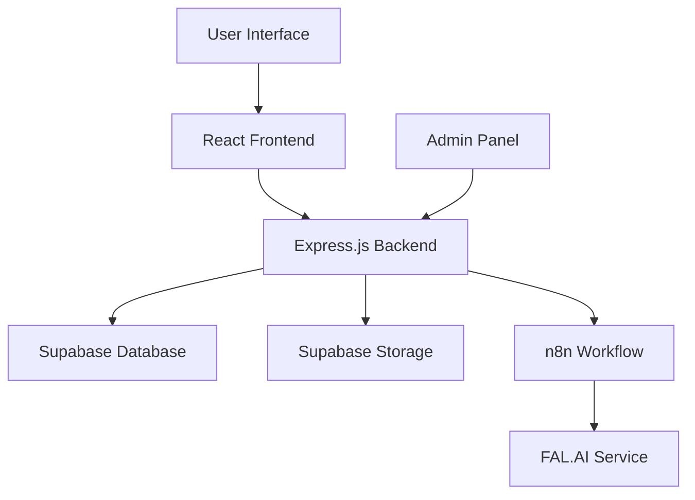
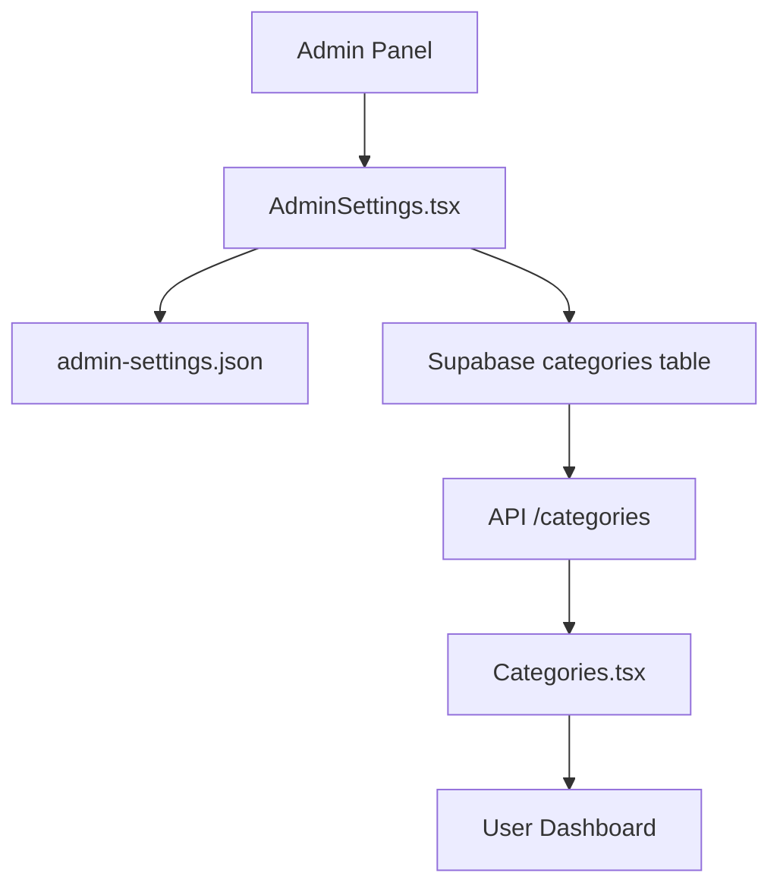

# ResimAI - Kapsamlı Proje Dokümantasyonu

## 1. Proje Genel Bakış

### 1.1 Proje Tanımı
ResimAI, yapay zeka destekli görsel işleme platformudur. Kullanıcılar fotoğraflarını yükleyerek çeşitli kategorilerde AI tabanlı düzenlemeler yapabilirler.

### 1.2 Ana Özellikler
- **AI Destekli Görsel İşleme**: FAL.AI entegrasyonu ile profesyonel görsel düzenleme
- **Kategori Bazlı İşleme**: Avatar, Corporate, Background, Skincare, Outfit, Fashion Photography
- **Kredi Sistemi**: Kullanıcı bazlı kredi yönetimi
- **Çok Dilli Destek**: Türkçe ve İngilizce
- **Admin Paneli**: Sistem yönetimi ve analitik
- **Real-time İşleme**: n8n workflow ile otomatik işlem takibi

### 1.3 Hedef Kitle
- Bireysel kullanıcılar (profil fotoğrafı düzenleme)
- İşletmeler (kurumsal görsel içerik)
- Sosyal medya kullanıcıları
- E-ticaret siteleri (ürün fotoğrafları)

## 2. Site Haritası ve Sayfa Yapısı

### 2.1 Ana Sayfa Yapısı
```
ResimAI/
├── Ana Sayfa (/)
│   ├── Hero Section
│   ├── Özellikler
│   ├── Kategori Önizleme
│   └── Testimonials
├── Kategoriler (/categories)
│   ├── Kategori Listesi
│   ├── Kategori Detay
│   └── Upload Interface
├── Galeri (/gallery)
│   ├── İşlenmiş Görseller
│   └── Filtreleme
├── Dashboard (/dashboard)
│   ├── Kredi Durumu
│   ├── İşlem Geçmişi
│   └── Profil Yönetimi
├── Fiyatlandırma (/pricing)
├── Giriş/Kayıt (/login, /register)
└── Admin Paneli (/admin)
    ├── Kullanıcı Yönetimi
    ├── İş Takibi
    ├── Analitik
    └── Sistem Ayarları
```

### 2.2 Sayfa Detayları

#### Ana Sayfa (/)
- **Hero Section**: Ana başlık, açıklama, CTA butonları
- **Özellik Kartları**: AI işleme yetenekleri
- **Kategori Önizleme**: Popüler kategoriler
- **Testimonial Carousel**: Kullanıcı yorumları
- **Footer**: Bağlantılar ve iletişim bilgileri

#### Kategoriler (/categories)
- **Kategori Grid**: Görsel kategori kartları
- **Upload Interface**: Dosya yükleme ve URL girişi
- **Stil Seçimi**: Kategori bazlı stil seçenekleri
- **Önizleme**: Yüklenen görsel önizlemesi
- **İşleme Butonu**: AI işleme başlatma

#### Dashboard (/dashboard)
- **Kredi Widget**: Kalan kredi gösterimi
- **Son İşlemler**: İşlem geçmişi tablosu
- **İstatistikler**: Kullanım analitikleri
- **Profil Ayarları**: Kullanıcı bilgileri

#### Admin Paneli (/admin)
- **Genel Bakış**: Sistem istatistikleri
- **Kullanıcı Yönetimi**: Kullanıcı listesi ve detayları
- **İş Takibi**: Aktif ve tamamlanan işler
- **Sistem Ayarları**: AI prompt'ları, kategori yönetimi
- **Analitik**: Detaylı kullanım raporları

## 3. Teknik Mimari

### 3.1 Genel Mimari


### 3.2 Teknoloji Stack'i

#### Frontend
- **Framework**: React 18 + TypeScript
- **Styling**: Tailwind CSS
- **Build Tool**: Vite
- **State Management**: React Context + Hooks
- **Routing**: React Router
- **HTTP Client**: Fetch API
- **Internationalization**: react-i18next
- **UI Components**: Custom components + Lucide icons

#### Backend
- **Framework**: Express.js + TypeScript
- **Authentication**: JWT + Supabase Auth
- **File Upload**: Multer
- **Validation**: Custom middleware
- **Process Management**: PM2
- **Environment**: Node.js 18+

#### Database & Storage
- **Database**: Supabase (PostgreSQL)
- **File Storage**: Supabase Storage
- **Authentication**: Supabase Auth
- **Real-time**: Supabase Realtime (opsiyonel)

#### AI & Workflow
- **Workflow Engine**: n8n
- **AI Service**: FAL.AI (Flux Pro)
- **Image Processing**: AI-powered enhancement
- **Webhook Integration**: n8n → Backend callback

### 3.3 Veritabanı Şeması

#### Ana Tablolar
```sql
-- Kullanıcılar
users (
  id UUID PRIMARY KEY,
  email VARCHAR UNIQUE,
  name VARCHAR,
  credits INTEGER DEFAULT 10,
  is_admin BOOLEAN DEFAULT false,
  created_at TIMESTAMP,
  updated_at TIMESTAMP
)

-- Kategoriler
categories (
  id UUID PRIMARY KEY,
  name VARCHAR,
  display_name_tr VARCHAR,
  display_name_en VARCHAR,
  type VARCHAR,
  description TEXT,
  description_en TEXT,
  image_url VARCHAR,
  styles TEXT[],
  styles_en TEXT[],
  is_active BOOLEAN DEFAULT true
)

-- İşler
image_jobs (
  id UUID PRIMARY KEY,
  user_id UUID REFERENCES users(id),
  category_id UUID REFERENCES categories(id),
  original_image_url VARCHAR,
  style VARCHAR,
  status VARCHAR CHECK (status IN ('pending', 'processing', 'completed', 'failed')),
  n8n_execution_id VARCHAR,
  error_message TEXT,
  created_at TIMESTAMP,
  updated_at TIMESTAMP
)

-- İşlenmiş Görseller
processed_images (
  id UUID PRIMARY KEY,
  job_id UUID REFERENCES image_jobs(id),
  image_url VARCHAR,
  thumbnail_url VARCHAR,
  file_size INTEGER,
  width INTEGER,
  height INTEGER,
  created_at TIMESTAMP
)

-- Kredi Kullanımı
credits_usage (
  id UUID PRIMARY KEY,
  user_id UUID REFERENCES users(id),
  job_id UUID REFERENCES image_jobs(id),
  credits_used INTEGER,
  operation_type VARCHAR,
  created_at TIMESTAMP
)
```

## 4. API Dokümantasyonu

### 4.1 Authentication Endpoints
```
POST /api/auth/login
POST /api/auth/register
POST /api/auth/logout
GET  /api/auth/me
```

### 4.2 Categories Endpoints
```
GET  /api/categories          # Tüm kategoriler
GET  /api/categories/:id      # Kategori detayı
```

### 4.3 Images Endpoints
```
POST /api/images/upload-and-process  # Görsel yükleme ve işleme
GET  /api/images/jobs               # Kullanıcı işleri
GET  /api/images/jobs/:id           # İş detayı
```

### 4.4 Admin Endpoints
```
GET  /api/admin/stats              # Sistem istatistikleri
GET  /api/admin/users              # Kullanıcı listesi
GET  /api/admin/users/:id          # Kullanıcı detayı
GET  /api/admin/jobs               # Tüm işler
GET  /api/admin-settings           # Sistem ayarları
PUT  /api/admin-settings           # Ayar güncelleme
PUT  /api/admin/settings/prompts   # AI prompt güncelleme
```

## 5. Son Düzeltmeler ve Çözülen Sorunlar

### 5.1 Kategori Gönderim Sorunu (Çözüldü)
**Sorun**: Categories.tsx'te kategori değeri 'undefined' olarak n8n'e gidiyordu.

**Çözüm**: 
- `Categories.tsx` dosyasında 130. satırda kategori gönderim kodu düzeltildi
- `uploadState.selectedCategory.type || uploadState.selectedCategory.name` yerine `uploadState.selectedCategory.name` kullanıldı
- Frontend'de kategori seçim mantığı iyileştirildi

### 5.2 Webhook Undefined Category Sorunu (Çözüldü)
**Sorun**: Backend'de webhook'a gönderilen category değeri undefined oluyordu.

**Çözüm**:
- `images.ts` dosyasında webhook gönderim sistemi tamamen yeniden yazıldı
- Kategori validasyon mantığı eklendi
- Güvenli kategori kontrolü implementasyonu
- Debug logları eklendi

### 5.3 Webhook Sistemi Yenileme (Tamamlandı)
**Değişiklikler**:
- Eski karmaşık webhook kodları temizlendi
- Basit ve güvenilir webhook gönderim fonksiyonu yazıldı
- Error handling iyileştirildi
- Admin-settings.json'dan webhook URL'si dinamik olarak alınıyor

### 5.4 TypeScript Build Sorunu (Çözüldü)
**Sorun**: Sunucuda TypeScript kodları compile edilmiyordu.

**Çözüm**:
- `npm run build:api` komutu eklendi
- Deployment sürecine TypeScript build adımı dahil edildi

## 6. Deployment Süreci

### 6.1 Geliştirme Ortamı Kurulumu
```bash
# Repository clone
git clone https://github.com/webalet/ResimAi.git
cd ResimAi

# Dependencies kurulumu
npm install

# Environment dosyası oluşturma
cp .env.example .env

# Geliştirme sunucusu başlatma
npm run dev
```

### 6.2 Test Aşamaları

#### Adım 1: Local Test
```bash
# TypeScript kontrolü
npm run type-check

# Lint kontrolü
npm run lint

# Build testi
npm run build

# API build testi
npm run build:api
```

#### Adım 2: Git Workflow
```bash
# Değişiklikleri stage'e alma
git add .

# Commit mesajı ile kaydetme
git commit -m "fix: kategori gönderim sorunu düzeltildi"

# Remote repository'ye gönderme
git push origin main
```

#### Adım 3: Sunucu Deployment
```bash
# Tam deployment (frontend + backend)
ssh root@64.226.75.76 "cd /var/www/ResimAi && git pull origin main && npm run build && pm2 restart all"

# Sadece API deployment
ssh root@64.226.75.76 "cd /var/www/ResimAi && git pull origin main && npm run build:api && pm2 restart resim-ai-api"

# Sadece frontend deployment
ssh root@64.226.75.76 "cd /var/www/ResimAi && git pull origin main && npm run build && pm2 restart resim-ai-frontend"
```

#### Adım 4: Log Takibi
```bash
# Tüm servislerin logları
ssh root@64.226.75.76 "pm2 logs --lines 20"

# Sadece API logları
ssh root@64.226.75.76 "pm2 logs resim-ai-api --lines 20"

# Sadece frontend logları
ssh root@64.226.75.76 "pm2 logs resim-ai-frontend --lines 20"

# Real-time log takibi
ssh root@64.226.75.76 "pm2 logs --follow"
```

### 6.3 Deployment Komutları Referansı

#### Temel SSH Komutları
```bash
# Sunucuya bağlanma
ssh root@64.226.75.76

# Proje dizinine gitme
cd /var/www/ResimAi

# Git durumu kontrolü
git status

# Son commit'leri görme
git log --oneline -5

# PM2 durum kontrolü
pm2 status

# PM2 servis yeniden başlatma
pm2 restart resim-ai-api
pm2 restart resim-ai-frontend
pm2 restart all
```

#### Hata Durumunda Debug
```bash
# Detaylı PM2 bilgisi
ssh root@64.226.75.76 "pm2 show resim-ai-api"

# Sistem kaynak kullanımı
ssh root@64.226.75.76 "pm2 monit"

# Node.js süreçleri
ssh root@64.226.75.76 "ps aux | grep node"

# Disk kullanımı
ssh root@64.226.75.76 "df -h"

# Memory kullanımı
ssh root@64.226.75.76 "free -h"
```

## 7. n8n Workflow Yapılandırması

### 7.1 Workflow Adımları
1. **Webhook Trigger**: Backend'den gelen istek
2. **Data Processing**: Gelen verileri işleme
3. **FAL.AI Request**: AI servisine istek gönderme
4. **Result Processing**: Sonuçları işleme
5. **Callback**: Backend'e sonuç gönderme

### 7.2 FAL.AI Entegrasyonu
```json
{
  "method": "POST",
  "url": "https://queue.fal.run/fal-ai/flux-pro",
  "headers": {
    "Authorization": "Key YOUR_FAL_API_KEY",
    "Content-Type": "application/json"
  },
  "body": {
    "prompt": "{{$json.query.prompt}}",
    "image_url": "{{$json.query.imageUrl}}",
    "strength": 0.8,
    "num_images": 1
  }
}
```

## 8. Güvenlik ve Performans

### 8.1 Güvenlik Önlemleri
- JWT tabanlı authentication
- Rate limiting (express-rate-limit)
- File upload validasyonu
- SQL injection koruması (Supabase)
- XSS koruması
- CORS yapılandırması

### 8.2 Performans Optimizasyonları
- Image lazy loading
- Component code splitting
- API response caching
- Database indexing
- CDN kullanımı (Supabase Storage)

## 9. Monitoring ve Analitik

### 9.1 Sistem Metrikleri
- Kullanıcı sayısı ve aktivitesi
- İşlem başarı oranları
- API response süreleri
- Hata oranları
- Kredi kullanım istatistikleri

### 9.2 Log Yapısı
```
[TIMESTAMP] [LEVEL] [MODULE] Message

Örnekler:
2025-08-16T21:38:20: ✅ [GENERATE PROMPT] Perfect match found
2025-08-16T21:38:21: 📤 [WEBHOOK] Sending webhook
2025-08-16T21:38:21: 🔍 [CATEGORY DEBUG] Category analysis
```

## 10. Gelecek Geliştirmeler

### 10.1 Planlanan Özellikler
- Batch processing (toplu işleme)
- Advanced filtering options
- Social media integration
- Mobile app development
- API rate limiting improvements
- Advanced analytics dashboard

### 10.2 Teknik İyileştirmeler
- Redis cache implementasyonu
- Database connection pooling
- Microservices architecture
- Docker containerization
- CI/CD pipeline kurulumu

## 11. Upload Mekanizması ve Kategori Senkronizasyonu

### 11.1 Upload İşlem Akışı

#### Dosya Yükleme Süreci
1. **Frontend Validasyon**: Categories.tsx'te dosya boyutu (50MB), tip kontrolü
2. **Multer İşleme**: Backend'de multer middleware ile dosya alımı
3. **Supabase Storage**: Dosya Supabase Storage'a yüklenir
4. **Veritabanı Kaydı**: image_jobs tablosuna iş kaydı oluşturulur
5. **n8n Webhook**: Workflow tetiklenir
6. **FAL.AI İşleme**: AI servisi ile görsel işlenir
7. **Sonuç Kaydetme**: İşlenmiş görsel processed_images tablosuna kaydedilir

#### Upload Limitler ve Konfigürasyon
```javascript
// Frontend - Categories.tsx
if (file.size > 50 * 1024 * 1024) {
  toast.error('Dosya boyutu 50MB\'dan büyük olamaz');
  return;
}

// Backend - server.ts
app.use(express.json({ limit: '50mb' }));
app.use(express.urlencoded({ limit: '50mb', extended: true }));

// Backend - images.ts (Multer)
const upload = multer({
  storage: multer.memoryStorage(),
  limits: {
    fileSize: 50 * 1024 * 1024 // 50MB
  }
});

// Nginx Konfigürasyonu
client_max_body_size 100M;
```

### 11.2 Kategori Senkronizasyon Sistemi

#### Admin Panel → User Dashboard Senkronizasyonu
1. **Admin Kategori Düzenleme**: AdminSettings.tsx'te kategoriler düzenlenir
2. **Çift Kaydetme**: saveCategories fonksiyonu kategorileri hem admin-settings.json'a hem Supabase'e kaydeder
3. **API Senkronizasyonu**: Her kategori için:
   - Mevcut kategori kontrolü (type bazında)
   - Varsa güncelleme (PUT /api/categories/:id)
   - Yoksa oluşturma (POST /api/categories)
4. **User Dashboard Yükleme**: Categories.tsx API'den kategorileri çeker (GET /api/categories)

#### Kategori Veri Akışı


#### Kategori Veri Yapısı
```typescript
interface Category {
  id: string;
  name: string;
  display_name_tr: string;
  display_name_en: string;
  type: string;
  description: string;
  description_en: string;
  image_url: string;
  styles: string[];
  styles_en: string[];
  is_active: boolean;
  created_at: string;
  updated_at: string;
}
```

### 11.3 Disk Depolama ve Supabase Entegrasyonu

#### Dosya Depolama Stratejisi
- **Geçici Depolama**: Multer memoryStorage() kullanır
- **Kalıcı Depolama**: Supabase Storage bucket'ları
- **URL Yapısı**: `https://pfpaeiysshitndugrzmmb.supabase.co/storage/v1/object/public/images/...`

#### Supabase Tablo İlişkileri
```sql
-- Ana iş kaydı
image_jobs (
  id UUID PRIMARY KEY,
  user_id UUID REFERENCES users(id),
  category_id UUID REFERENCES categories(id),
  original_image_url VARCHAR,
  style VARCHAR,
  status VARCHAR,
  n8n_execution_id VARCHAR
)

-- İşlenmiş sonuçlar
processed_images (
  id UUID PRIMARY KEY,
  job_id UUID REFERENCES image_jobs(id),
  image_url VARCHAR,
  thumbnail_url VARCHAR
)
```

### 11.4 n8n Workflow Entegrasyonu

#### Webhook Gönderim Süreci
```javascript
// Backend - images.ts
const webhookData = {
  jobId: job.id,
  userId: user.id,
  imageUrl: imageUrl,
  category: category.name,
  style: style,
  prompt: generatedPrompt
};

// n8n webhook'una gönderim
const webhookResponse = await fetch(webhookUrl, {
  method: 'POST',
  headers: { 'Content-Type': 'application/json' },
  body: JSON.stringify(webhookData)
});
```

#### Callback İşleme
```javascript
// n8n'den gelen sonuç callback'i
router.post('/webhook/callback', async (req, res) => {
  const { jobId, status, resultImageUrl, error } = req.body;
  
  // İş durumunu güncelle
  await supabase
    .from('image_jobs')
    .update({ status, error_message: error })
    .eq('id', jobId);
    
  // Başarılıysa işlenmiş görseli kaydet
  if (status === 'completed' && resultImageUrl) {
    await supabase
      .from('processed_images')
      .insert({
        job_id: jobId,
        image_url: resultImageUrl
      });
  }
});
```

## 12. Sorun Giderme Rehberi

### 12.1 Yaygın Sorunlar

#### "Category undefined" Hatası
**Çözüm**: Categories.tsx'te kategori gönderim kodunu kontrol et
```bash
# Log kontrolü
ssh root@64.226.75.76 "pm2 logs resim-ai-api --lines 20 | grep CATEGORY"
```

#### TypeScript Build Hatası
**Çözüm**: API build komutunu çalıştır
```bash
ssh root@64.226.75.76 "cd /var/www/ResimAi && npm run build:api && pm2 restart resim-ai-api"
```

#### n8n Workflow Hatası
**Çözüm**: n8n interface'den workflow'u kontrol et ve FAL.AI API key'ini doğrula

### 11.2 Acil Durum Komutları
```bash
# Tüm servisleri yeniden başlat
ssh root@64.226.75.76 "pm2 restart all"

# Sadece API'yi yeniden başlat
ssh root@64.226.75.76 "pm2 restart resim-ai-api"

# PM2 süreçlerini temizle ve yeniden başlat
ssh root@64.226.75.76 "pm2 delete all && pm2 start ecosystem.config.cjs"

# Git'i son commit'e geri al
ssh root@64.226.75.76 "cd /var/www/ResimAi && git reset --hard HEAD~1"
```

## 13. Son Güncellemeler ve Düzeltmeler (17 Ağustos 2025)

### 13.1 UI/UX İyileştirmeleri

#### Kategori Başlığı Z-Index Sorunu (Çözüldü)
**Sorun**: Categories.tsx sayfasında kategori başlığı overlay div'in altında kalıyordu ve görünmüyordu.

**Çözüm**: 
- `Categories.tsx` dosyasında overlay div'e `z-40` sınıfı eklendi
- Kategori başlığının görünürlüğü sağlandı
- Z-index hiyerarşisi düzeltildi

**Etkilenen Dosyalar**:
- `src/pages/Categories.tsx`

**Teknik Detaylar**:
```tsx
// Önceki kod
<div className="fixed inset-0 bg-black bg-opacity-50 flex items-center justify-center p-4">

// Düzeltilmiş kod
<div className="fixed inset-0 bg-black bg-opacity-50 flex items-center justify-center p-4 z-40">
```

#### Modal Responsive Düzeltmesi (Tamamlandı)
**Sorun**: Gallery.tsx'teki modal penceresi mobil cihazlarda uyumsuz görünüyordu ve sabit boyutlar kullanıyordu.

**Çözüm**: 
- Sabit genişlik ve yükseklik değerleri kaldırıldı
- Responsive sınıflar eklendi: `max-w-[90vw]`, `max-h-[80vh]`, `w-full`, `h-full`
- Masaüstü için daha büyük boyutlar: `sm:max-w-[80vw]`, `lg:max-w-[70vw]`, `xl:max-w-[60vw]`
- `ImageComparison` bileşeni responsive hale getirildi

**Etkilenen Dosyalar**:
- `src/pages/Gallery.tsx`

**Teknik Detaylar**:
```tsx
// Modal container responsive sınıfları
className="max-w-sm sm:max-w-md md:max-w-lg lg:max-w-2xl xl:max-w-4xl max-h-[70vh] lg:max-h-[85vh] w-full h-full bg-white rounded-lg overflow-hidden"

// ImageComparison responsive sınıfları
className="sm:max-w-[80vw] lg:max-w-[70vw] xl:max-w-[60vw] max-h-[70vh] lg:max-h-[85vh] w-full h-full"
```

### 13.2 Çeviri ve Yönlendirme Düzeltmeleri

#### Çeviri Hataları Düzeltmesi (Çözüldü)
**Sorun**: Gallery.tsx'te `h3`, `p` ve `a` etiketlerinde çeviri anahtarları eksikti.

**Çözüm**: 
- `tr.json` ve `en.json` dosyalarına `gallery.empty` bölümü eklendi
- Türkçe çeviriler: "Henüz fotoğrafınız yok", "İlk AI destekli fotoğraf işleminizi başlatmak için yeni bir kategori seçin.", "Yeni Fotoğraf İşle"
- İngilizce çeviriler: "No photos yet", "Select a new category to start your first AI-powered photo processing.", "Process New Photo"

**Etkilenen Dosyalar**:
- `src/i18n/locales/tr.json`
- `src/i18n/locales/en.json`

**Teknik Detaylar**:
```json
// tr.json'a eklenen bölüm
"gallery": {
  "empty": {
    "title": "Henüz fotoğrafınız yok",
    "description": "İlk AI destekli fotoğraf işleminizi başlatmak için yeni bir kategori seçin.",
    "createNew": "Yeni Fotoğraf İşle"
  }
}
```

#### Yönlendirme Sorunu Düzeltmesi (Çözüldü)
**Sorun**: Gallery.tsx'te boş durum Link bileşeni yanlış yere (ana sayfaya) yönlendiriyordu.

**Çözüm**: 
- Link bileşeninin `to` özelliği `/` yerine `/categories` olarak değiştirildi
- Kullanıcılar artık doğrudan kategoriler sayfasına yönlendiriliyor

**Etkilenen Dosyalar**:
- `src/pages/Gallery.tsx`

**Teknik Detaylar**:
```tsx
// Önceki kod
<Link to="/" className="...">

// Düzeltilmiş kod
<Link to="/categories" className="...">
```

### 13.3 Bileşen Optimizasyonları

#### LazyImage Bileşeni İyileştirmeleri (Tamamlandı)
**Sorun**: LazyImage bileşeninde görsel yükleme durumu kontrolü ve opacity geçişleri sorunluydu.

**Çözüm**: 
- `imageLoaded` state kontrolü düzeltildi
- Opacity geçiş animasyonları iyileştirildi
- Default `objectFit` değeri `contain` yerine `cover` yapıldı
- Görsel yükleme performansı artırıldı

**Etkilenen Dosyalar**:
- `src/components/LazyImage.tsx`

**Teknik Detaylar**:
```tsx
// objectFit default değeri değiştirildi
objectFit = 'cover' // önceden 'contain' idi

// Opacity kontrolü iyileştirildi
className={`transition-opacity duration-300 ${!imageLoaded ? 'opacity-0' : 'opacity-100'}`}
```

#### ImageComparison Bileşeni Güncellemeleri (Tamamlandı)
**Sorun**: ImageComparison bileşeninde LazyImage kullanımında explicit height ve objectFit ayarları eksikti.

**Çözüm**: 
- LazyImage bileşenlerine `objectFit='cover'` prop'u eklendi
- Explicit height değerleri tanımlandı
- Görsel karşılaştırma deneyimi iyileştirildi

**Etkilenen Dosyalar**:
- `src/components/ImageComparison.tsx`
- `src/pages/Categories.tsx` (ImageComparison kullanılan yerler)

**Teknik Detaylar**:
```tsx
// LazyImage'e objectFit prop'u eklendi
<LazyImage
  src={beforeImage}
  alt="Before"
  objectFit="cover"
  className="w-full h-full object-cover"
/>
```

### 13.4 Performans İyileştirmeleri

#### Görsel Yükleme Optimizasyonu
- LazyImage bileşeninde loading state yönetimi iyileştirildi
- Görsel geçiş animasyonları optimize edildi
- Memory leak'leri önlemek için cleanup fonksiyonları eklendi

#### Responsive Tasarım Geliştirmeleri
- Modal pencereler tüm cihaz boyutlarında optimize edildi
- Breakpoint'ler daha detaylı tanımlandı
- Mobile-first yaklaşım benimsenip masaüstü için ek optimizasyonlar yapıldı

### 13.5 Kod Kalitesi İyileştirmeleri

#### TypeScript Tip Güvenliği
- Tüm bileşenlerde prop tiplerinin doğru tanımlandığı kontrol edildi
- Optional prop'lar için default değerler belirlendi
- Type assertion'lar minimize edildi

#### CSS Sınıf Optimizasyonu
- Tailwind CSS sınıfları daha verimli kullanıldı
- Responsive sınıflar sistematik hale getirildi
- Gereksiz CSS sınıfları temizlendi

---

**Son Güncelleme**: 17 Ağustos 2025  
**Versiyon**: 1.1  
**Hazırlayan**: AI Assistant  
**Durum**: Aktif Geliştirme

---

*Bu dokümantasyon, ResimAI projesinin mevcut durumunu yansıtmaktadır. Gelecekteki AI asistanları bu dokümantasyonu referans alarak projeyi hızlıca anlayabilir ve geliştirme sürecine katkıda bulunabilir.*