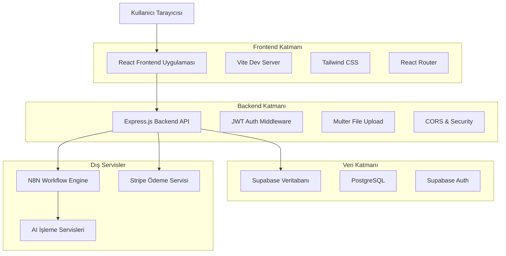
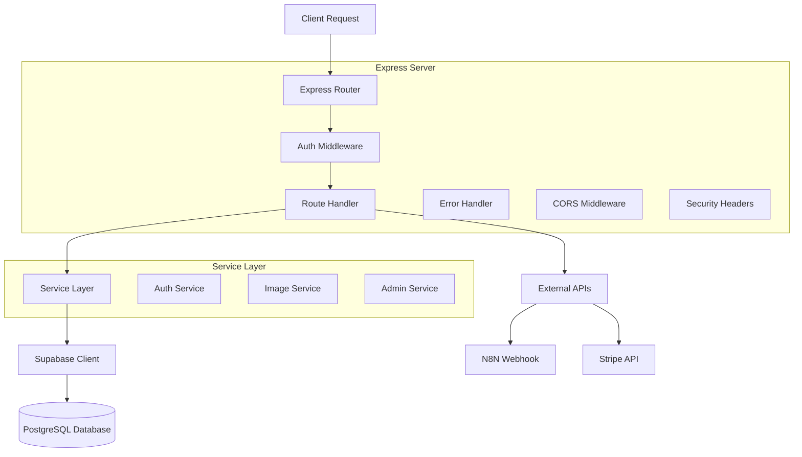
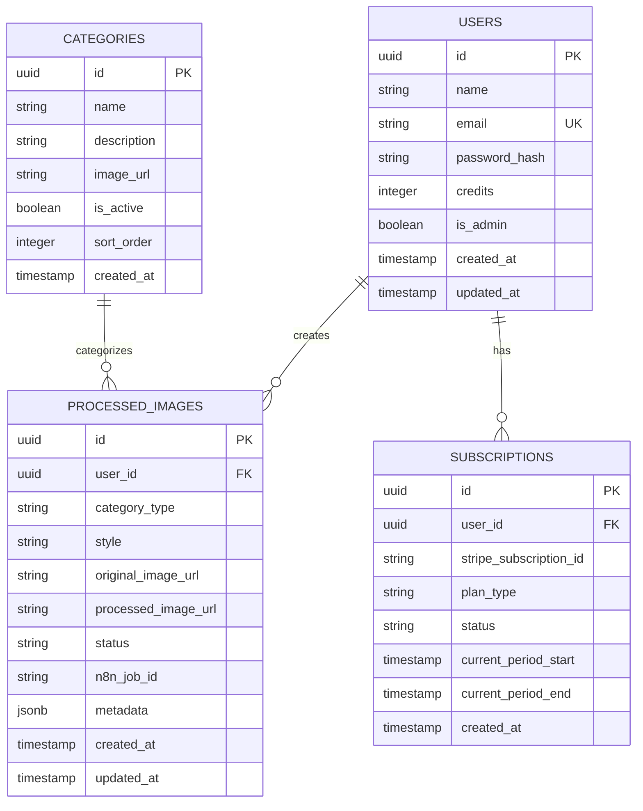
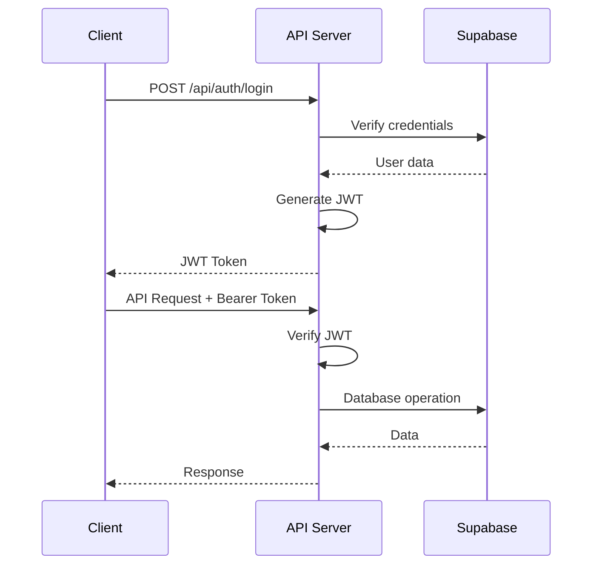

# ResimAI Teknik Mimari Dokümantasyonu

## 1. Mimari Tasarım



## 2. Teknoloji Açıklaması

### Frontend Stack
- **React@18.3.1** - Modern UI framework, hooks ve concurrent features
- **TypeScript** - Tip güvenliği ve geliştirici deneyimi
- **Vite@6.3.5** - Hızlı build tool ve dev server
- **React Router DOM@7.3.0** - Client-side routing ve navigation
- **Tailwind CSS@3.4.17** - Utility-first CSS framework
- **Zustand@5.0.3** - Lightweight state management
- **React i18next** - Çok dilli destek
- **Lucide React** - Modern icon library

### Backend Stack
- **Express.js@4.21.2** - Web application framework
- **Node.js** - JavaScript runtime environment
- **TypeScript** - Server-side tip güvenliği
- **Supabase Client** - Database ve auth operations
- **JWT** - Stateless authentication
- **Multer@2.0.2** - Multipart form data handling
- **bcryptjs@3.0.2** - Password hashing

### Veritabanı ve Servisler
- **Supabase** - PostgreSQL tabanlı BaaS
- **Stripe@18.4.0** - Ödeme işlemleri
- **N8N** - Workflow automation ve AI processing

## 3. Route Tanımları

### Frontend Routes

| Route | Amaç | Koruma |
|-------|------|--------|
| `/` | Ana sayfa yönlendirmesi | Public |
| `/:lang` | Dil bazlı ana sayfa | Public |
| `/:lang/login` | Kullanıcı girişi | Public |
| `/:lang/register` | Kullanıcı kaydı | Public |
| `/:lang/pricing` | Fiyatlandırma sayfası | Public |
| `/:lang/dashboard` | Kullanıcı dashboard'u | Protected |
| `/:lang/categories` | Kategori seçimi | Protected |
| `/:lang/gallery` | Kullanıcı galerisi | Protected |
| `/:lang/subscription` | Abonelik yönetimi | Protected |
| `/:lang/profile` | Profil ayarları | Protected |
| `/admin/login` | Admin girişi | Public |
| `/admin` | Admin dashboard | Admin Only |
| `/admin/users` | Kullanıcı yönetimi | Admin Only |
| `/admin/jobs` | İş takibi | Admin Only |
| `/admin/analytics` | Analitik veriler | Admin Only |
| `/admin/settings` | Admin ayarları | Admin Only |

## 4. API Tanımları

### 4.1 Authentication API

#### Kullanıcı Kaydı
```
POST /api/auth/register
```

**Request:**
| Parametre | Tip | Zorunlu | Açıklama |
|-----------|-----|---------|----------|
| name | string | true | Kullanıcı adı |
| email | string | true | E-posta adresi |
| password | string | true | Şifre (min 6 karakter) |

**Response:**
| Parametre | Tip | Açıklama |
|-----------|-----|----------|
| success | boolean | İşlem durumu |
| data.user | object | Kullanıcı bilgileri |
| data.token | string | JWT token |

**Örnek:**
```json
{
  "name": "Ahmet Yılmaz",
  "email": "ahmet@example.com",
  "password": "123456"
}
```

#### Kullanıcı Girişi
```
POST /api/auth/login
```

**Request:**
| Parametre | Tip | Zorunlu | Açıklama |
|-----------|-----|---------|----------|
| email | string | true | E-posta adresi |
| password | string | true | Şifre |

**Response:**
| Parametre | Tip | Açıklama |
|-----------|-----|----------|
| success | boolean | İşlem durumu |
| data.user | object | Kullanıcı bilgileri |
| data.token | string | JWT token |

### 4.2 Image Processing API

#### Görsel Yükleme
```
POST /api/images/upload
```

**Headers:**
- `Authorization: Bearer <token>`
- `Content-Type: multipart/form-data`

**Request (FormData):**
| Parametre | Tip | Zorunlu | Açıklama |
|-----------|-----|---------|----------|
| image | file | true | Görsel dosyası (max 10MB) |
| categoryType | string | true | Kategori türü |
| style | string | true | İşleme stili |

**Response:**
| Parametre | Tip | Açıklama |
|-----------|-----|----------|
| success | boolean | İşlem durumu |
| data.jobId | string | İş takip ID'si |
| data.status | string | İşlem durumu |

### 4.3 Admin API

#### Kullanıcı Listesi
```
GET /api/admin/users
```

**Headers:**
- `Authorization: Bearer <admin_token>`

**Query Parameters:**
| Parametre | Tip | Zorunlu | Açıklama |
|-----------|-----|---------|----------|
| page | number | false | Sayfa numarası (default: 1) |
| limit | number | false | Sayfa başına kayıt (default: 10) |
| search | string | false | Arama terimi |

**Response:**
| Parametre | Tip | Açıklama |
|-----------|-----|----------|
| success | boolean | İşlem durumu |
| data.users | array | Kullanıcı listesi |
| data.total | number | Toplam kullanıcı sayısı |
| data.page | number | Mevcut sayfa |

## 5. Sunucu Mimarisi



## 6. Veri Modeli

### 6.1 Veri Modeli Tanımı



### 6.2 Veri Tanımlama Dili (DDL)

#### Users Tablosu
```sql
-- Kullanıcılar tablosu
CREATE TABLE users (
    id UUID PRIMARY KEY DEFAULT gen_random_uuid(),
    name VARCHAR(255) NOT NULL,
    email VARCHAR(255) UNIQUE NOT NULL,
    password_hash VARCHAR(255) NOT NULL,
    credits INTEGER DEFAULT 1,
    is_admin BOOLEAN DEFAULT FALSE,
    created_at TIMESTAMP WITH TIME ZONE DEFAULT NOW(),
    updated_at TIMESTAMP WITH TIME ZONE DEFAULT NOW()
);

-- İndeksler
CREATE INDEX idx_users_email ON users(email);
CREATE INDEX idx_users_created_at ON users(created_at DESC);

-- RLS (Row Level Security) Politikaları
ALTER TABLE users ENABLE ROW LEVEL SECURITY;

-- Kullanıcılar sadece kendi kayıtlarını görebilir
CREATE POLICY "Users can view own profile" ON users
    FOR SELECT USING (auth.uid() = id);

-- Kullanıcılar kendi profillerini güncelleyebilir
CREATE POLICY "Users can update own profile" ON users
    FOR UPDATE USING (auth.uid() = id);
```

#### Processed Images Tablosu
```sql
-- İşlenmiş görseller tablosu
CREATE TABLE processed_images (
    id UUID PRIMARY KEY DEFAULT gen_random_uuid(),
    user_id UUID REFERENCES users(id) ON DELETE CASCADE,
    category_type VARCHAR(50) NOT NULL,
    style VARCHAR(100) NOT NULL,
    original_image_url TEXT,
    processed_image_url TEXT,
    status VARCHAR(20) DEFAULT 'pending' CHECK (status IN ('pending', 'processing', 'completed', 'failed')),
    n8n_job_id VARCHAR(255),
    metadata JSONB DEFAULT '{}',
    created_at TIMESTAMP WITH TIME ZONE DEFAULT NOW(),
    updated_at TIMESTAMP WITH TIME ZONE DEFAULT NOW()
);

-- İndeksler
CREATE INDEX idx_processed_images_user_id ON processed_images(user_id);
CREATE INDEX idx_processed_images_status ON processed_images(status);
CREATE INDEX idx_processed_images_created_at ON processed_images(created_at DESC);
CREATE INDEX idx_processed_images_category ON processed_images(category_type);

-- RLS Politikaları
ALTER TABLE processed_images ENABLE ROW LEVEL SECURITY;

-- Kullanıcılar sadece kendi görsellerini görebilir
CREATE POLICY "Users can view own images" ON processed_images
    FOR SELECT USING (auth.uid() = user_id);

-- Kullanıcılar yeni görsel ekleyebilir
CREATE POLICY "Users can insert own images" ON processed_images
    FOR INSERT WITH CHECK (auth.uid() = user_id);
```

#### Categories Tablosu
```sql
-- Kategoriler tablosu
CREATE TABLE categories (
    id UUID PRIMARY KEY DEFAULT gen_random_uuid(),
    name VARCHAR(100) NOT NULL,
    description TEXT,
    image_url TEXT,
    is_active BOOLEAN DEFAULT TRUE,
    sort_order INTEGER DEFAULT 0,
    created_at TIMESTAMP WITH TIME ZONE DEFAULT NOW()
);

-- İndeksler
CREATE INDEX idx_categories_active ON categories(is_active);
CREATE INDEX idx_categories_sort_order ON categories(sort_order);

-- RLS Politikaları
ALTER TABLE categories ENABLE ROW LEVEL SECURITY;

-- Herkes aktif kategorileri görebilir
CREATE POLICY "Anyone can view active categories" ON categories
    FOR SELECT USING (is_active = TRUE);

-- Başlangıç verileri
INSERT INTO categories (name, description, image_url, sort_order) VALUES
('Corporate', 'Profesyonel kurumsal görünüm', '/images/categories/corporate.jpg', 1),
('Creative', 'Yaratıcı ve artistik stiller', '/images/categories/creative.jpg', 2),
('Avatar', 'Kişisel avatar oluşturma', '/images/categories/avatar.jpg', 3),
('Outfit', 'Kıyafet ve moda stilleri', '/images/categories/outfit.jpg', 4),
('Background', 'Arka plan değişimi', '/images/categories/background.jpg', 5),
('Skincare', 'Cilt bakımı ve güzellik', '/images/categories/skincare.jpg', 6);
```

#### Subscriptions Tablosu
```sql
-- Abonelikler tablosu
CREATE TABLE subscriptions (
    id UUID PRIMARY KEY DEFAULT gen_random_uuid(),
    user_id UUID REFERENCES users(id) ON DELETE CASCADE,
    stripe_subscription_id VARCHAR(255) UNIQUE,
    plan_type VARCHAR(50) NOT NULL CHECK (plan_type IN ('free', 'basic', 'professional', 'enterprise')),
    status VARCHAR(50) DEFAULT 'active' CHECK (status IN ('active', 'canceled', 'past_due', 'unpaid')),
    current_period_start TIMESTAMP WITH TIME ZONE,
    current_period_end TIMESTAMP WITH TIME ZONE,
    created_at TIMESTAMP WITH TIME ZONE DEFAULT NOW(),
    updated_at TIMESTAMP WITH TIME ZONE DEFAULT NOW()
);

-- İndeksler
CREATE INDEX idx_subscriptions_user_id ON subscriptions(user_id);
CREATE INDEX idx_subscriptions_stripe_id ON subscriptions(stripe_subscription_id);
CREATE INDEX idx_subscriptions_status ON subscriptions(status);

-- RLS Politikaları
ALTER TABLE subscriptions ENABLE ROW LEVEL SECURITY;

-- Kullanıcılar sadece kendi aboneliklerini görebilir
CREATE POLICY "Users can view own subscriptions" ON subscriptions
    FOR SELECT USING (auth.uid() = user_id);
```

## 7. Güvenlik Konfigürasyonu

### 7.1 Authentication Flow



### 7.2 Middleware Stack

```javascript
// Security middleware sırası
app.use(helmet()); // Security headers
app.use(cors(corsOptions)); // CORS policy
app.use(express.json({ limit: '10mb' })); // Body parser
app.use(rateLimit(rateLimitOptions)); // Rate limiting
app.use('/api/protected', auth); // Authentication
app.use('/api/admin', adminAuth); // Admin authorization
```

### 7.3 Environment Variables

```bash
# Kritik güvenlik değişkenleri
JWT_SECRET=your_super_secure_jwt_secret_key_here
SUPABASE_URL=https://your-project.supabase.co
SUPABASE_ANON_KEY=your_supabase_anon_key
SUPABASE_SERVICE_ROLE_KEY=your_supabase_service_role_key
STRIPE_SECRET_KEY=sk_live_your_stripe_secret_key
N8N_WEBHOOK_URL=https://your-n8n-instance.com/webhook/resim-ai
```

## 8. Deployment Konfigürasyonu

### 8.1 Production Build

```bash
# Frontend build
npm run build:prod

# Backend build
npm run build:api

# Start production server
npm run start:api
```

### 8.2 Docker Konfigürasyonu (Önerilen)

```dockerfile
# Dockerfile.frontend
FROM node:18-alpine
WORKDIR /app
COPY package*.json ./
RUN npm ci --only=production
COPY . .
RUN npm run build
EXPOSE 5173
CMD ["npm", "run", "preview"]

# Dockerfile.backend
FROM node:18-alpine
WORKDIR /app
COPY api/package*.json ./
RUN npm ci --only=production
COPY api/ .
RUN npm run build
EXPOSE 3001
CMD ["npm", "run", "start"]
```

### 8.3 Nginx Konfigürasyonu

```nginx
server {
    listen 80;
    server_name your-domain.com;
    
    # Frontend
    location / {
        proxy_pass http://localhost:5173;
        proxy_set_header Host $host;
        proxy_set_header X-Real-IP $remote_addr;
    }
    
    # Backend API
    location /api {
        proxy_pass http://localhost:3001;
        proxy_set_header Host $host;
        proxy_set_header X-Real-IP $remote_addr;
        proxy_set_header X-Forwarded-For $proxy_add_x_forwarded_for;
    }
}
```

---

*Bu teknik mimari dokümantasyonu, ResimAI projesinin sistem tasarımını ve implementasyon detaylarını içermektedir.*