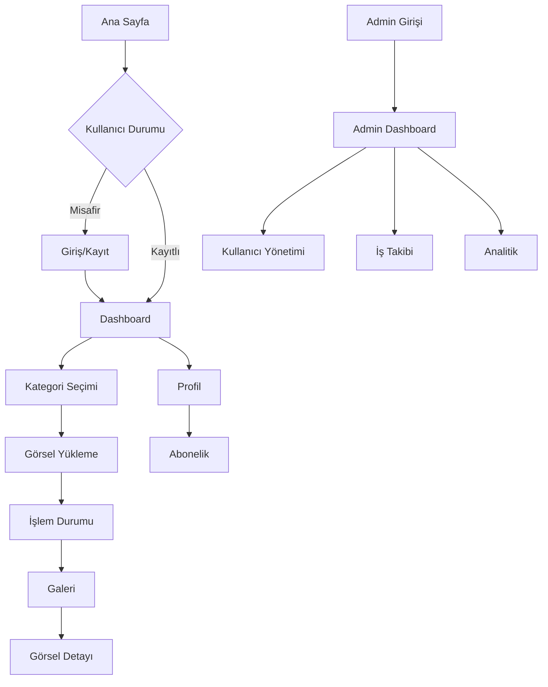

# ResimAI Ürün Gereksinimleri Dokümantasyonu (PRD)

## 1. Ürün Genel Bakış

ResimAI, yapay zeka teknolojisi kullanarak kullanıcıların fotoğraflarını profesyonel kalitede sanat eserlerine dönüştüren web tabanlı bir platformdur. Platform, farklı kategorilerde görsel işleme hizmeti sunarak bireysel ve kurumsal kullanıcıların ihtiyaçlarını karşılar.

Platform, kullanıcıların görsellerini yükleyerek çeşitli AI stilleri ile işlemesine olanak tanır ve sonuçları hızlı bir şekilde sunar. Freemium model ile ücretsiz deneme imkanı sunarken, premium özellikler için abonelik sistemi bulunur.

## 2. Temel Özellikler

### 2.1 Kullanıcı Rolleri

| Rol | Kayıt Yöntemi | Temel Yetkiler |
|-----|---------------|----------------|
| Misafir Kullanıcı | Kayıt gerekmez | Ana sayfayı görüntüleme, örnekleri inceleme |
| Kayıtlı Kullanıcı | E-posta ile kayıt | 1 ücretsiz kredi, görsel yükleme ve işleme |
| Premium Kullanıcı | Ödeme ile yükseltme | Sınırsız işleme, öncelikli destek, gelişmiş özellikler |
| Admin | Sistem tarafından atama | Tüm kullanıcı ve sistem yönetimi |

### 2.2 Özellik Modülleri

ResimAI platformu aşağıdaki ana sayfalardan oluşur:

1. **Ana Sayfa**: Hero bölümü, özellik tanıtımı, örnek çalışmalar, müşteri yorumları
2. **Kategori Seçimi**: Görsel işleme kategorilerinin listesi ve seçimi
3. **Dashboard**: Kullanıcı ana paneli, kredi durumu, son işlemler
4. **Galeri**: İşlenmiş görsellerin görüntülenmesi ve yönetimi
5. **Profil**: Kullanıcı bilgileri ve hesap ayarları
6. **Abonelik**: Plan seçimi ve ödeme işlemleri
7. **Admin Panel**: Sistem yönetimi ve analitik

### 2.3 Sayfa Detayları

| Sayfa Adı | Modül Adı | Özellik Açıklaması |
|-----------|-----------|--------------------|
| Ana Sayfa | Hero Bölümü | Platformun ana tanıtımı, CTA butonları, görsel slider |
| Ana Sayfa | Özellikler | AI teknolojisi, hız, güvenlik, kategori çeşitliliği tanıtımı |
| Ana Sayfa | Örnek Çalışmalar | Before/after görsel örnekleri, kategori bazlı showcase |
| Ana Sayfa | Müşteri Yorumları | Kullanıcı testimonial'ları, rating sistemi |
| Giriş/Kayıt | Kimlik Doğrulama | E-posta/şifre ile giriş, sosyal medya login, şifre sıfırlama |
| Kategori Seçimi | Kategori Listesi | 6 ana kategori (Kurumsal, Yaratıcı, Avatar, Kıyafet, Arka Plan, Cilt Bakımı) |
| Kategori Seçimi | Stil Seçimi | Her kategori için alt stil seçenekleri, önizleme |
| Kategori Seçimi | Görsel Yükleme | Drag&drop upload, format kontrolü, boyut sınırı |
| Dashboard | Kredi Durumu | Mevcut kredi sayısı, kullanım geçmişi, yenileme seçenekleri |
| Dashboard | Son İşlemler | İşlem durumu, progress bar, sonuç önizlemesi |
| Dashboard | Hızlı Erişim | Popüler kategoriler, son kullanılan stiller |
| Galeri | Görsel Listesi | Grid layout, filtreleme, arama, sıralama |
| Galeri | Görsel Detayı | Büyük görüntüleme, indirme, paylaşma, silme |
| Galeri | Toplu İşlemler | Çoklu seçim, toplu indirme, toplu silme |
| Profil | Kişisel Bilgiler | Ad, e-posta, şifre değiştirme, profil fotoğrafı |
| Profil | Hesap Ayarları | Dil seçimi, bildirim tercihleri, gizlilik ayarları |
| Profil | İstatistikler | Toplam işlem sayısı, kullanılan kredi, üyelik süresi |
| Abonelik | Plan Seçimi | Ücretsiz, Temel, Profesyonel, Kurumsal planlar |
| Abonelik | Ödeme İşlemi | Stripe entegrasyonu, kredi kartı, fatura bilgileri |
| Abonelik | Fatura Yönetimi | Ödeme geçmişi, fatura indirme, iptal işlemleri |
| Admin Panel | Dashboard | Sistem istatistikleri, kullanıcı metrikleri, gelir analizi |
| Admin Panel | Kullanıcı Yönetimi | Kullanıcı listesi, detay görüntüleme, hesap yönetimi |
| Admin Panel | İş Takibi | İşlem kuyruğu, başarısız işlemler, sistem durumu |
| Admin Panel | Analitik | Grafik ve raporlar, kullanım trendleri, performans metrikleri |

## 3. Temel Süreçler

### Misafir Kullanıcı Akışı
Misafir kullanıcılar ana sayfayı ziyaret ederek platformun özelliklerini keşfedebilir, örnek çalışmaları inceleyebilir ve kayıt olmaya karar verebilir. Kayıt işlemi basit e-posta/şifre kombinasyonu ile gerçekleşir.

### Kayıtlı Kullanıcı Akışı
Kayıtlı kullanıcılar giriş yaptıktan sonra dashboard'a yönlendirilir. Buradan kategori seçimi yaparak görsel yükleme sürecini başlatabilir. İşlem tamamlandığında galeri bölümünden sonuçları görüntüleyebilir.

### Premium Kullanıcı Akışı
Premium kullanıcılar tüm özelliklere erişim sağlar, sınırsız işlem yapabilir ve öncelikli destek alır. Abonelik yönetimi profil bölümünden gerçekleştirilir.

### Admin Akışı
Admin kullanıcılar özel giriş sayfası üzerinden sisteme erişir ve admin panelinde tüm sistem yönetimi işlemlerini gerçekleştirir.

## 4. Kullanıcı Arayüzü Tasarımı

### 4.1 Tasarım Stili

**Renk Paleti:**
- Ana Renk: #3B82F6 (Mavi)
- İkincil Renk: #10B981 (Yeşil)
- Vurgu Rengi: #F59E0B (Turuncu)
- Nötr Renkler: #F9FAFB, #6B7280, #111827

**Buton Stili:**
- Birincil butonlar: Yuvarlatılmış köşeler (8px), gradient efekt
- İkincil butonlar: Outline stil, hover efektleri
- CTA butonlar: Büyük boyut, belirgin renkler

**Tipografi:**
- Ana Font: Inter (sistem fontu fallback ile)
- Başlık boyutları: 32px, 24px, 20px, 18px
- Gövde metni: 16px, 14px
- Font ağırlıkları: 400 (normal), 500 (medium), 600 (semibold), 700 (bold)

**Layout Stili:**
- Card-based tasarım
- Grid sistem (12 kolon)
- Üst navigasyon menüsü
- Sidebar (admin paneli için)
- Responsive breakpoint'ler: 640px, 768px, 1024px, 1280px

**İkon ve Emoji Stili:**
- Lucide React icon seti
- 16px, 20px, 24px boyutları
- Outline stil ikonlar
- Tutarlı stroke width (1.5px)

### 4.2 Sayfa Tasarım Genel Bakışı

| Sayfa Adı | Modül Adı | UI Elementleri |
|-----------|-----------|----------------|
| Ana Sayfa | Hero Bölümü | Büyük başlık, alt başlık, 2 CTA butonu, arka plan görseli, animasyonlu elementler |
| Ana Sayfa | Özellikler | 4 kolon grid, ikon + başlık + açıklama kartları, hover efektleri |
| Ana Sayfa | Örnekler | Masonry layout, before/after slider, kategori filtreleri |
| Ana Sayfa | Yorumlar | Carousel slider, kullanıcı avatarları, yıldız rating, otomatik geçiş |
| Giriş/Kayıt | Form | Merkezi card layout, input alanları, sosyal login butonları, form validasyonu |
| Dashboard | Kredi Kartı | Progress bar, sayısal gösterim, yenileme butonu, gradient arka plan |
| Dashboard | İşlem Listesi | Tablo layout, durum badge'leri, progress indicator, aksiyon butonları |
| Kategori | Grid Layout | 2x3 kategori kartları, hover zoom efekti, kategori isimleri, örnek görseller |
| Galeri | Grid Layout | Responsive grid, lazy loading, lightbox modal, filtreleme sidebar |
| Admin Panel | Sidebar | Sabit sol menü, aktif sayfa vurgusu, collapse özelliği, logo alanı |
| Admin Panel | İstatistik Kartları | 4 kolon metrics, renk kodlu değerler, trend ikonları, hover efektleri |

### 4.3 Responsive Tasarım

Platform mobile-first yaklaşımı ile tasarlanmıştır:

**Mobil (< 768px):**
- Hamburger menü
- Tek kolon layout
- Touch-friendly butonlar (min 44px)
- Swipe gesture desteği

**Tablet (768px - 1024px):**
- 2 kolon grid
- Sidebar collapse
- Touch ve mouse hybrid deneyimi

**Desktop (> 1024px):**
- Tam özellikli layout
- Hover efektleri
- Keyboard navigation
- Multi-column layouts

## 5. Teknik Gereksinimler

### 5.1 Performans Gereksinimleri

- **Sayfa Yükleme Süresi:** < 3 saniye (3G bağlantıda)
- **İlk İçerik Boyası (FCP):** < 1.5 saniye
- **En Büyük İçerik Boyası (LCP):** < 2.5 saniye
- **Kümülatif Layout Kayması (CLS):** < 0.1
- **İlk Giriş Gecikmesi (FID):** < 100ms

### 5.2 Güvenlik Gereksinimleri

- HTTPS zorunluluğu
- JWT tabanlı authentication
- Rate limiting (API koruması)
- Input validation ve sanitization
- File upload güvenliği
- CORS policy konfigürasyonu

### 5.3 Ölçeklenebilirlik Gereksinimleri

- **Eş zamanlı kullanıcı:** 1000+ kullanıcı
- **Günlük işlem:** 10,000+ görsel işleme
- **Dosya depolama:** 1TB+ kapasitesi
- **API rate limit:** 100 request/dakika per user

### 5.4 Tarayıcı Desteği

- **Modern Tarayıcılar:** Chrome 90+, Firefox 88+, Safari 14+, Edge 90+
- **Mobil Tarayıcılar:** iOS Safari 14+, Chrome Mobile 90+
- **Özellik Desteği:** ES2020, WebP, CSS Grid, Flexbox

## 6. İş Kuralları

### 6.1 Kredi Sistemi

- Yeni kullanıcılar 1 ücretsiz kredi alır
- Her görsel işleme 1 kredi harcar
- Premium kullanıcılar sınırsız krediye sahiptir
- Krediler transfer edilemez ve iade edilemez

### 6.2 Dosya Yükleme Kuralları

- **Desteklenen formatlar:** JPEG, PNG, WebP
- **Maksimum dosya boyutu:** 10MB
- **Minimum çözünürlük:** 512x512 piksel
- **Maksimum çözünürlük:** 4096x4096 piksel

### 6.3 İşlem Kuralları

- İşlem süresi maksimum 5 dakika
- Başarısız işlemler kredi iadesi yapılır
- Eş zamanlı işlem limiti: 3 işlem per user
- İşlem geçmişi 1 yıl saklanır

### 6.4 Abonelik Kuralları

- Aylık ve yıllık ödeme seçenekleri
- İptal durumunda mevcut dönem sonuna kadar erişim
- Downgrade işlemi dönem sonunda geçerli olur
- Upgrade işlemi anında geçerli olur

## 7. Entegrasyon Gereksinimleri

### 7.1 Ödeme Entegrasyonu

- **Stripe** ile kredi kartı ödemeleri
- 3D Secure desteği
- Webhook ile ödeme durumu takibi
- Fatura oluşturma ve e-posta gönderimi

### 7.2 AI İşleme Entegrasyonu

- **N8N** workflow engine ile AI servis bağlantısı
- Asenkron işlem takibi
- Webhook callback sistemi
- Hata durumu yönetimi

### 7.3 E-posta Entegrasyonu

- Hoş geldin e-postaları
- İşlem tamamlanma bildirimleri
- Abonelik durumu bildirimleri
- Şifre sıfırlama e-postaları

### 7.4 Analitik Entegrasyonu

- Google Analytics 4
- Kullanıcı davranış takibi
- Conversion tracking
- Custom event'ler

## 8. Kalite Güvencesi

### 8.1 Test Gereksinimleri

- **Unit Test Coverage:** %80+
- **Integration Test:** Kritik API endpoint'leri
- **E2E Test:** Ana kullanıcı akışları
- **Performance Test:** Load testing
- **Security Test:** Penetration testing

### 8.2 Monitoring ve Logging

- Application performance monitoring
- Error tracking ve alerting
- User session recording
- API response time monitoring
- Database performance monitoring

## 9. Gelecek Özellikler (Roadmap)

### 9.1 Kısa Vadeli (3 ay)

- Batch processing (toplu işlem)
- API rate limiting iyileştirmesi
- Mobile app (React Native)
- Advanced filtering (galeri)

### 9.2 Orta Vadeli (6 ay)

- Real-time collaboration
- Custom AI model training
- White-label solution
- Advanced analytics dashboard

### 9.3 Uzun Vadeli (12 ay)

- AI video processing
- Marketplace (user-generated styles)
- Enterprise SSO integration
- Multi-language support expansion

---

*Bu ürün gereksinimleri dokümantasyonu, ResimAI platformunun mevcut durumunu ve gelecek planlarını detaylandırmaktadır. Dokümantasyon, geliştirme sürecinde rehber olarak kullanılmalı ve düzenli olarak güncellenmelidir.*