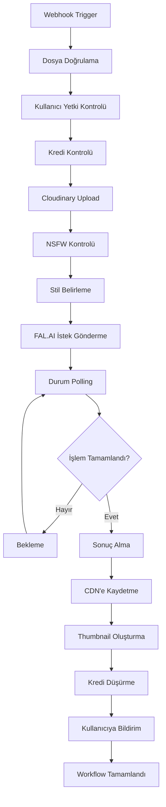

# ResimAI - n8n Workflow Dokümantasyonu

## 1. Workflow Genel Bakış

Bu dokümantasyon, ResimAI platformunun görsel işleme sürecini yöneten n8n workflow'larını detaylandırır. Ana workflow, kullanıcı görsel yüklemesinden işlenmiş sonuçların teslim edilmesine kadar olan tüm süreci kapsar.

### Ana Workflow Akışı


## 2. Webhook Konfigürasyonu

### 2.1 Ana Webhook (Görsel Yükleme)

**Node Adı**: `Görsel Yükleme Webhook`
**Tip**: Webhook
**Method**: POST
**Path**: `/webhook/image-upload`
**Authentication**: Header Based (Bearer Token)

**Beklenen Payload (Dinamik Prompt Sistemi ile)**:
```json
{
  "user_id": "uuid",
  "imageUrl": "string",
  "category": "Corporate|Creative|Avatar|Outfit|Background|Skincare",
  "style": "string",
  "prompt": "dinamik_olarak_oluşturulan_prompt",
  "file_data": "base64_encoded_image",
  "file_name": "string",
  "file_type": "image/jpeg|image/png|image/webp"
}
```

**Dinamik Prompt Örnekleri**:
```json
{
  "Corporate": {
    "Klasik": "Put the person in a traditional office environment with classic wooden furniture and formal atmosphere. Also, make sure they wear a classic business suit with traditional styling and conservative colors.",
    "Modern": "Put the person in a modern tech office environment with glass walls, contemporary furniture, and innovative workspace design. Also, make sure they wear a sleek contemporary business suit with modern cut and trendy styling.",
    "Resmi": "Put the person in a very formal corporate boardroom environment with mahogany furniture and executive atmosphere. Also, make sure they wear a strictly formal business suit with conservative styling, tie, and traditional corporate appearance."
  },
  "Creative": {
    "Sanatsal": "Transform the person with artistic effects: add colorful paint splashes on their face and hair, apply vibrant artistic makeup with bold colors, add creative face painting designs, and enhance with artistic lighting effects on the person. Keep the original background unchanged, focus only on making the person artistic and colorful.",
    "Renkli": "Create a vibrant and colorful portrait with rainbow color palette, dynamic lighting effects, and energetic atmosphere with bright saturated colors throughout the composition.",
    "Minimalist": "Create a minimalist portrait with clean lines, neutral color palette, simple geometric shapes, and elegant composition with plenty of white space and subtle shadows."
  }
}
```

**Response Format**:
```json
{
  "success": true,
  "job_id": "workflow_execution_id",
  "estimated_time": 30,
  "message": "Görsel işleme başlatıldı"
}
```

## 3. Node Detayları

### 3.1 Dosya Doğrulama Node'u

**Node Adı**: `Dosya Doğrulama`
**Tip**: Function

```javascript
// Dosya boyutu ve format kontrolü
const fileData = $json.file_data;
const fileName = $json.file_name;
const fileType = $json.file_type;
const categoryType = $json.category_type;
const styleType = $json.style_type;

// Desteklenen formatlar
const supportedTypes = ['image/jpeg', 'image/png', 'image/webp'];

// Base64 boyut hesaplama (yaklaşık)
const fileSizeBytes = (fileData.length * 3) / 4;
const maxSizeBytes = 10 * 1024 * 1024; // 10MB

if (!supportedTypes.includes(fileType)) {
  throw new Error(`Desteklenmeyen dosya formatı: ${fileType}`);
}

if (fileSizeBytes > maxSizeBytes) {
  throw new Error(`Dosya boyutu çok büyük: ${Math.round(fileSizeBytes / 1024 / 1024)}MB`);
}

// Kategori validasyonu (Güncellenmiş)
const allowedCategories = ['Corporate', 'Creative', 'Avatar', 'Outfit', 'Background', 'Skincare'];
if (!allowedCategories.includes(categoryType)) {
  throw new Error(`Geçersiz kategori: ${categoryType}`);
}

// Kategori bazlı stil validasyonu (Güncellenmiş)
const categoryStyles = {
  'Corporate': ['Klasik', 'Modern', 'Resmi'],
  'Creative': ['Sanatsal', 'Renkli', 'Minimalist'],
  'Avatar': ['Çizgi Film', 'Realistik', 'Fantastik'],
  'Outfit': ['Casual', 'Formal', 'Spor'],
  'Background': ['Ofis', 'Doğa', 'Stüdyo'],
  'Skincare': ['Doğal', 'Pürüzsüz', 'Parlak']
};

// Dinamik prompt kontrolü
const dynamicPrompt = $json.prompt;
if (!dynamicPrompt || dynamicPrompt.length < 10) {
  throw new Error('Dinamik prompt eksik veya çok kısa');
}

const allowedStyles = categoryStyles[categoryType] || [];
if (!allowedStyles.includes(styleType)) {
  throw new Error(`${categoryType} kategorisi için geçersiz stil: ${styleType}`);
}

// Dosya adı temizleme
const cleanFileName = fileName.replace(/[^a-zA-Z0-9.-]/g, '_');
const timestamp = Date.now();
const finalFileName = `${$json.user_id}_${timestamp}_${cleanFileName}`;

return {
  ...$json,
  file_name: finalFileName,
  file_size: fileSizeBytes,
  validation_passed: true
};
```

### 3.2 Kullanıcı Yetki Kontrolü

**Node Adı**: `Kullanıcı Yetki Kontrolü`
**Tip**: HTTP Request
**Method**: GET
**URL**: `{{ $env.BACKEND_URL }}/api/user/verify`
**Headers**:
```json
{
  "Authorization": "Bearer {{ $json.auth_token }}",
  "Content-Type": "application/json"
}
```

**Beklenen Response**:
```json
{
  "valid": true,
  "user_id": "uuid",
  "subscription_plan": "free|premium|pro",
  "remaining_credits": 5,
  "allowed_categories": ["kurumsal", "linkedin", "yaratici"],
  "daily_limit": 10
}
```

**Kategori Yetki Kontrolü Function**:
```javascript
const userResponse = $json;
const requestedCategory = $previous.category_type;

// Plan bazlı kategori kontrolü (Güncellenmiş)
const planCategories = {
  'free': ['Creative'],
  'premium': ['Corporate', 'Creative', 'Avatar'],
  'pro': ['Corporate', 'Creative', 'Avatar', 'Outfit', 'Background', 'Skincare']
};

const allowedCategories = planCategories[userResponse.subscription_plan] || [];
if (!allowedCategories.includes(requestedCategory)) {
  throw new Error(`${userResponse.subscription_plan} planında ${requestedCategory} kategorisi kullanılamaz. Lütfen planınızı yükseltin.`);
}

// Günlük limit kontrolü
if (userResponse.daily_usage >= userResponse.daily_limit) {
  throw new Error('Günlük işlem limitiniz dolmuş. Yarın tekrar deneyin.');
}

// Kredi kontrolü
if (userResponse.remaining_credits <= 0) {
  throw new Error('Kredi limitiniz dolmuş. Lütfen planınızı yükseltin.');
}

return {
  ...userResponse,
  category_allowed: true,
  can_process: true
};
```

### 3.3 Cloudinary Upload

**Node Adı**: `Cloudinary Upload`
**Tip**: HTTP Request
**Method**: POST
**URL**: `https://api.cloudinary.com/v1_1/{{ $env.CLOUDINARY_CLOUD_NAME }}/image/upload`

**Body (form-data)**:
```json
{
  "file": "data:{{ $json.file_type }};base64,{{ $json.file_data }}",
  "upload_preset": "{{ $env.CLOUDINARY_UPLOAD_PRESET }}",
  "folder": "resimai/originals",
  "public_id": "{{ $json.file_name }}",
  "resource_type": "image"
}
```

### 3.4 NSFW Kontrolü

**Node Adı**: `NSFW Kontrolü`
**Tip**: HTTP Request
**Method**: POST
**URL**: `https://api.moderatecontent.com/moderate/`
**Headers**:
```json
{
  "Authorization": "Bearer {{ $env.MODERATE_CONTENT_API_KEY }}"
}
```

**Body**:
```json
{
  "url": "{{ $json.cloudinary_url }}",
  "models": ["nudity", "gore", "face-attributes"],
  "category_context": "{{ $json.category_type }}"
}
```

### 3.5 Stil Belirleme ve Prompt Oluşturma

**Node Adı**: `Stil Belirleme`
**Tip**: Function

```javascript
const categoryType = $json.category_type;
const styleType = $json.style_type;
const styleOptions = $json.style_options || {};

let prompt = "";
let negativePrompt = "text, watermark, lowres, artifacts";

// Kategori bazlı prompt oluşturma
switch (categoryType) {
  case 'kurumsal':
    switch (styleType) {
      case 'takim_elbise':
        prompt = `Professional corporate headshot: subject wearing formal business suit, crisp white shirt, professional tie, confident posture, studio lighting, neutral corporate background, sharp focus on face, executive style, high-end business photography, 4K quality.`;
        break;
      case 'blazer':
        prompt = `Business casual portrait: subject in professional blazer, smart casual shirt, approachable yet professional demeanor, soft studio lighting, modern office background, corporate headshot style.`;
        break;
      case 'gomlek':
        prompt = `Clean professional look: subject in crisp dress shirt, no tie, business casual style, natural lighting, minimal background, professional but approachable appearance.`;
        break;
      default:
        prompt = `Professional corporate headshot with ${styleType} style, business attire, studio lighting, corporate background.`;
    }
    negativePrompt += ", casual clothing, unprofessional appearance, poor lighting";
    break;
    
  case 'linkedin':
    switch (styleType) {
      case 'profesyonel':
        prompt = `LinkedIn professional headshot: confident smile, professional attire, clean background, natural lighting, trustworthy appearance, networking-ready photo, social media optimized.`;
        break;
      case 'dostane':
        prompt = `Friendly LinkedIn profile photo: warm smile, approachable expression, professional but personable, soft lighting, clean background, networking-focused.`;
        break;
      case 'guvenilir':
        prompt = `Trustworthy LinkedIn headshot: confident expression, professional attire, direct eye contact, reliable appearance, clean studio background.`;
        break;
      default:
        prompt = `LinkedIn headshot with ${styleType} style, professional social media photo.`;
    }
    negativePrompt += ", unprofessional, overly casual, poor quality";
    break;
    
  case 'yaratici':
    switch (styleType) {
      case 'sinematik':
        prompt = `Cinematic portrait: dramatic lighting, film-like color grading, artistic composition, creative background, movie poster style, high contrast, professional cinematography.`;
        break;
      case 'pop_art':
        prompt = `Pop art style portrait: vibrant colors, artistic interpretation, bold contrasts, creative digital art style, modern artistic approach.`;
        break;
      case 'vintage':
        prompt = `Vintage style portrait: retro color grading, classic photography style, nostalgic atmosphere, film photography aesthetic.`;
        break;
      default:
        prompt = `Creative artistic portrait with ${styleType} style, artistic interpretation, unique visual approach.`;
    }
    negativePrompt += ", boring composition, flat lighting, generic style";
    break;
    
  case 'avatar':
    switch (styleType) {
      case 'minimalist':
        prompt = `Minimalist avatar: clean simple design, reduced details, geometric shapes, modern flat design, profile icon style, transparent background.`;
        break;
      case 'cizgi_roman':
        prompt = `Cartoon avatar: comic book style, illustrated character, vibrant colors, stylized features, animated appearance.`;
        break;
      case '3d':
        prompt = `3D avatar: three-dimensional character design, rendered appearance, modern 3D graphics style, gaming character aesthetic.`;
        break;
      default:
        prompt = `Avatar design with ${styleType} style, profile icon, digital character representation.`;
    }
    negativePrompt += ", photorealistic, complex details, cluttered design";
    break;
    
  case 'arkaplan':
    switch (styleType) {
      case 'studyo_beyaz':
        prompt = `Studio white background replacement: clean white backdrop, professional studio lighting, seamless background removal, portrait photography style.`;
        break;
      case 'doga':
        prompt = `Natural background replacement: outdoor nature setting, green environment, natural lighting, landscape background.`;
        break;
      case 'sehir':
        prompt = `Urban background replacement: city skyline, modern urban environment, architectural background, metropolitan setting.`;
        break;
      case 'transparan':
        prompt = `Transparent background: complete background removal, clean cutout, PNG format, isolated subject, no background.`;
        break;
      default:
        prompt = `Background replacement with ${styleType} style, clean background change.`;
    }
    negativePrompt += ", rough edges, halo effects, poor cutout quality";
    break;
    
  default:
    throw new Error(`Desteklenmeyen kategori: ${categoryType}`);
}

return {
  ...$json,
  final_prompt: prompt,
  negative_prompt: negativePrompt,
  processing_config: {
    guidance_scale: styleOptions.guidance_scale || 3.5,
    num_images: styleOptions.variants || 1,
    output_format: styleType === 'background' || styleType === 'avatar' ? 'png' : 'jpeg'
  }
};
```

### 3.6 FAL.AI İstek Gönderme

**Node Adı**: `FAL.AI İstek Gönder`
**Tip**: HTTP Request
**Method**: POST
**URL**: `https://queue.fal.run/fal-ai/flux-pro/kontext`
**Headers**:
```json
{
  "Authorization": "Key {{ $env.FAL_API_KEY }}",
  "Content-Type": "application/json"
}
```

**Body**:
```json
{
  "prompt": "{{ $json.final_prompt }}",
  "negative_prompt": "{{ $json.negative_prompt }}",
  "image_url": "{{ $json.cloudinary_url }}",
  "guidance_scale": "{{ $json.processing_config.guidance_scale }}",
  "num_images": "{{ $json.processing_config.num_images }}",
  "output_format": "{{ $json.processing_config.output_format }}",
  "safety_tolerance": 2,
  "seed": null,
  "sync_mode": false
}
```

### 3.7 Durum Polling Loop

**Node Adı**: `Durum Kontrolü`
**Tip**: HTTP Request
**Method**: GET
**URL**: `https://queue.fal.run/fal-ai/flux-pro/requests/{{ $json.request_id }}/status`
**Headers**:
```json
{
  "Authorization": "Key {{ $env.FAL_API_KEY }}"
}
```

**Bekleme Node'u**:
**Node Adı**: `Bekleme`
**Tip**: Wait
**Amount**: 5
**Unit**: seconds

**Durum Kontrolü (If Node)**:
**Node Adı**: `İşlem Tamamlandı mı?`
**Tip**: If
**Condition**: `{{ $json.status === 'COMPLETED' }}`

### 3.8 Sonuç Alma ve İşleme

**Node Adı**: `Sonuç Al`
**Tip**: HTTP Request
**Method**: GET
**URL**: `https://queue.fal.run/fal-ai/flux-pro/requests/{{ $json.request_id }}`

**Sonuç İşleme Function**:
```javascript
const result = $json;
const outputs = result.outputs || [];

if (!outputs.length) {
  throw new Error('İşlem tamamlandı ancak sonuç bulunamadı');
}

const processedImages = outputs.map((output, index) => ({
  url: output.url,
  width: output.width,
  height: output.height,
  format: output.content_type?.split('/')[1] || 'jpeg',
  variant_index: index
}));

return {
  ...result,
  processed_images: processedImages,
  total_images: processedImages.length
};
```

### 3.9 CDN'e Kaydetme ve Thumbnail

**Node Adı**: `CDN Kaydet`
**Tip**: Function (Loop over processed_images)

```javascript
const images = $json.processed_images;
const savedImages = [];

for (const [index, image] of images.entries()) {
  // Her görsel için Cloudinary'ye kaydetme
  const uploadResponse = await fetch('https://api.cloudinary.com/v1_1/' + process.env.CLOUDINARY_CLOUD_NAME + '/image/upload', {
    method: 'POST',
    body: JSON.stringify({
      file: image.url,
      upload_preset: process.env.CLOUDINARY_UPLOAD_PRESET,
      folder: 'resimai/processed',
      public_id: `${$json.user_id}_${Date.now()}_${index}`,
      transformation: [
        { quality: 'auto:good' },
        { fetch_format: 'auto' }
      ]
    }),
    headers: { 'Content-Type': 'application/json' }
  });
  
  const uploadResult = await uploadResponse.json();
  
  // Thumbnail oluşturma
  const thumbnailUrl = uploadResult.secure_url.replace('/upload/', '/upload/w_300,h_300,c_fill,q_auto/');
  
  savedImages.push({
    original_url: image.url,
    cdn_url: uploadResult.secure_url,
    thumbnail_url: thumbnailUrl,
    public_id: uploadResult.public_id,
    width: image.width,
    height: image.height,
    format: image.format,
    file_size: uploadResult.bytes
  });
}

return {
  ...$json,
  saved_images: savedImages
};
```

### 3.10 Kredi Düşürme ve Veritabanı Güncelleme

**Node Adı**: `Kredi Düşür`
**Tip**: HTTP Request
**Method**: POST
**URL**: `{{ $env.BACKEND_URL }}/api/credits/deduct`
**Headers**:
```json
{
  "Authorization": "Bearer {{ $env.BACKEND_API_KEY }}",
  "Content-Type": "application/json"
}
```

**Body**:
```json
{
  "user_id": "{{ $json.user_id }}",
  "job_id": "{{ $json.workflow_id }}",
  "credits_used": "{{ $json.total_images }}",
  "operation_type": "image_processing",
  "category_type": "{{ $json.category_type }}",
  "style_type": "{{ $json.style_type }}",
  "processed_images": "{{ $json.saved_images }}",
  "processing_time_ms": "{{ $json.processing_duration }}"
}
```

**İş Kaydı Oluşturma**:
```javascript
// İşlem geçmişi için veritabanına kayıt
const jobRecord = {
  user_id: $json.user_id,
  job_id: $json.workflow_id,
  category_type: $json.category_type,
  style_type: $json.style_type,
  original_image_url: $json.original_cloudinary_url,
  processed_images: $json.saved_images,
  credits_used: $json.total_images,
  processing_time_ms: $json.processing_duration,
  status: 'completed',
  created_at: new Date().toISOString()
};

// Veritabanına kaydet
fetch(`${process.env.BACKEND_URL}/api/jobs/create`, {
  method: 'POST',
  headers: {
    'Authorization': `Bearer ${process.env.BACKEND_API_KEY}`,
    'Content-Type': 'application/json'
  },
  body: JSON.stringify(jobRecord)
});

return {
  ...$json,
  job_recorded: true
};
```

### 3.11 Kullanıcı Bildirimi

**Node Adı**: `Kullanıcı Bildir`
**Tip**: HTTP Request
**Method**: POST
**URL**: `{{ $env.BACKEND_URL }}/api/notifications/send`

**Body**:
```json
{
  "user_id": "{{ $json.user_id }}",
  "type": "image_processing_completed",
  "data": {
    "job_id": "{{ $json.workflow_id }}",
    "total_images": "{{ $json.total_images }}",
    "style_type": "{{ $json.style_type }}",
    "gallery_url": "{{ $env.FRONTEND_URL }}/gallery?job={{ $json.workflow_id }}"
  }
}
```

## 4. Hata Yönetimi

### 4.1 Hata Yakalama Node'ları

Her kritik node'dan sonra hata yakalama node'u eklenmelidir:

**Node Adı**: `Hata Yakalayıcı`
**Tip**: Function
**Trigger**: On Error

```javascript
const error = $json.error || 'Bilinmeyen hata';
const errorCode = $json.errorCode || 'UNKNOWN_ERROR';

// Hata loglaması
console.error('Workflow Error:', {
  workflowId: $json.workflow_id,
  userId: $json.user_id,
  error: error,
  errorCode: errorCode,
  timestamp: new Date().toISOString()
});

// Kullanıcıya hata bildirimi
const errorMessage = {
  'FILE_TOO_LARGE': 'Dosya boyutu çok büyük (max 10MB)',
  'UNSUPPORTED_FORMAT': 'Desteklenmeyen dosya formatı',
  'NSFW_DETECTED': 'Görsel içerik politikalarımıza uygun değil',
  'INSUFFICIENT_CREDITS': 'Yetersiz kredi bakiyesi',
  'AI_PROCESSING_FAILED': 'Görsel işleme başarısız oldu',
  'UNKNOWN_ERROR': 'Beklenmeyen bir hata oluştu'
}[errorCode] || 'Beklenmeyen bir hata oluştu';

return {
  success: false,
  error: errorMessage,
  errorCode: errorCode,
  timestamp: new Date().toISOString()
};
```

### 4.2 Retry Mekanizması

**FAL.AI API için Retry Logic**:
```javascript
const maxRetries = 3;
let currentRetry = $json.retry_count || 0;

if (currentRetry < maxRetries) {
  // Exponential backoff
  const waitTime = Math.pow(2, currentRetry) * 1000; // 1s, 2s, 4s
  
  return {
    ...$json,
    retry_count: currentRetry + 1,
    wait_time: waitTime,
    should_retry: true
  };
} else {
  throw new Error('Maksimum deneme sayısına ulaşıldı');
}
```

## 5. Monitoring ve Logging

### 5.1 Workflow Metrikleri

Her workflow execution için aşağıdaki metrikler toplanmalıdır:

```javascript
// Workflow başlangıcında
const startTime = Date.now();
const metrics = {
  workflow_id: $json.workflow_id,
  user_id: $json.user_id,
  style_type: $json.style_type,
  file_size: $json.file_size,
  start_time: startTime
};

// Workflow sonunda
const endTime = Date.now();
const finalMetrics = {
  ...metrics,
  end_time: endTime,
  duration_ms: endTime - startTime,
  success: true,
  images_processed: $json.total_images,
  credits_used: $json.total_images
};

// Metrics API'ye gönderme
fetch(`${process.env.BACKEND_URL}/api/metrics/workflow`, {
  method: 'POST',
  headers: { 'Content-Type': 'application/json' },
  body: JSON.stringify(finalMetrics)
});
```

## 6. Environment Variables

```bash
# n8n Environment Variables
FAL_API_KEY=fal_xxxxxxxxxx
CLOUDINARY_CLOUD_NAME=your_cloud_name
CLOUDINARY_UPLOAD_PRESET=resimai_preset
MODERATE_CONTENT_API_KEY=moderate_xxxxxxxxxx
BACKEND_URL=https://api.resimai.com
BACKEND_API_KEY=backend_xxxxxxxxxx
FRONTEND_URL=https://resimai.com

# Webhook Security
WEBHOOK_SECRET=webhook_secret_key

# Rate Limiting
MAX_CONCURRENT_JOBS=10
MAX_JOBS_PER_USER_PER_HOUR=20
```

## 7. Deployment ve Scaling

### 7.1 n8n Konfigürasyonu

```yaml
# docker-compose.yml
version: '3.8'
services:
  n8n:
    image: n8nio/n8n:latest
    environment:
      - N8N_BASIC_AUTH_ACTIVE=true
      - N8N_BASIC_AUTH_USER=admin
      - N8N_BASIC_AUTH_PASSWORD=secure_password
      - WEBHOOK_URL=https://n8n.resimai.com
      - N8N_METRICS=true
    volumes:
      - n8n_data:/home/node/.n8n
    ports:
      - "5678:5678"
    restart: unless-stopped
```

### 7.2 Scaling Considerations

- **Queue Management**: Redis ile job queue implementasyonu
- **Load Balancing**: Multiple n8n instances behind load balancer
- **Resource Limits**: CPU ve memory limits per workflow
- **Monitoring**: Prometheus + Grafana integration

Bu dokümantasyon, ResimAI platformunun n8n workflow implementasyonu için kapsamlı bir rehber sağlar ve production ortamında güvenilir bir şekilde çalışacak şekilde tasarlanmıştır.