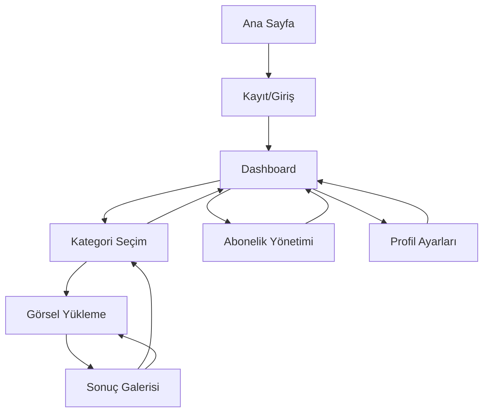

# ResimAI - AI Görsel İşleme Platformu Ürün Gereksinimleri

## 1. Ürün Genel Bakış
ResimAI, kullanıcıların tek bir görsel yükleyerek BetterPic tarzında profesyonel fotoğraf düzenleme ve AI destekli görsel üretimi yapabilecekleri SaaS platformudur. Platform, arka plan temizleme, retouch, farklı stiller ve çıktı seçenekleriyle yeni görseller üretir.

Sistem, kullanıcı kayıt ve abonelik sistemi ile entegre çalışır ve ücretsiz değildir. Hedef pazar, profesyonel LinkedIn fotoğrafları, sosyal medya içerikleri ve yaratıcı görsel tasarımlar ihtiyacı olan bireysel kullanıcılar ve küçük işletmelerdir.

## 2. Temel Özellikler

### 2.1 Kullanıcı Rolleri
| Rol | Kayıt Yöntemi | Temel Yetkiler |
|-----|---------------|----------------|
| Ücretsiz Kullanıcı | E-posta kayıt + doğrulama | Aylık 5 görsel işleme hakkı, temel stiller |
| Premium Kullanıcı | Aylık abonelik | Aylık 50 görsel, tüm stiller, öncelikli işleme |
| Pro Kullanıcı | Yıllık abonelik | Sınırsız görsel, API erişimi, toplu işleme |

### 2.2 Kategori Sistemi ve Dinamik Prompt Sistemi
Platformumuz BetterPic benzeri kategori tabanlı görsel işleme sistemi sunar ve her kategori-stil kombinasyonu için özel dinamik prompt'lar kullanır:

#### Ana Kategoriler ve Dinamik Prompt Sistemi
1. **Corporate (Kurumsal)**: Profesyonel iş fotoğrafları, şirket profilleri, resmi etkinlikler
   - **Klasik**: Geleneksel ofis ortamı, ahşap mobilyalar, klasik iş kıyafetleri
   - **Modern**: Teknoloji odaklı modern ofis, cam duvarlar, çağdaş iş kıyafetleri
   - **Resmi**: Çok resmi kurumsal toplantı salonu, mahogany mobilyalar, katı resmi kıyafetler

2. **Creative (Yaratıcı)**: Artistik ve stilize edilmiş fotoğraflar, sanatsal efektler
   - **Sanatsal**: Karakter odaklı renkli boya sıçramaları, artistik makyaj, yüz boyası efektleri
   - **Renkli**: Canlı renk paletleri, gökkuşağı efektleri, dinamik arka plan öğeleri
   - **Minimalist**: Temiz çizgiler, nötr renkler, zarif kompozisyon

3. **Avatar**: Profil simgeleri, oyun karakterleri, dijital kimlik görselleri
   - **Çizgi Film**: Büyük gözler, yumuşak hatlar, animasyon tarzı özellikler
   - **Realistik**: Doğal insan özellikleri ve orantıları korunması
   - **Fantastik**: Büyülü elementler, mistik özellikler, fantezi tarzı dönüşümler

4. **Outfit (Kıyafet)**: Kıyafet değiştirme ve stil dönüşümleri
   - **Casual**: Kot pantolon, rahat t-shirt, günlük ayakkabı
   - **Formal**: Zarif elbise, takım elbise, resmi ayakkabı
   - **Spor**: Atletik kıyafetler, spor ayakkabıları, aktif yaşam tarzı

5. **Background (Arka Plan)**: Background replacement, stüdyo efektleri
   - **Ofis**: Modern çalışma alanı, teknoloji, profesyonel atmosfer
   - **Doğa**: Yeşil alanlar, doğal ışık, huzurlu atmosfer
   - **Stüdyo**: Profesyonel aydınlatma, temiz arka plan

6. **Skincare (Cilt Bakımı)**: Cilt iyileştirme ve güzelleştirme
   - **Doğal**: Sağlıklı görünüm, doğal cilt tonu korunması
   - **Pürüzsüz**: Cilt dokusunu iyileştirme, kusurları giderme
   - **Parlak**: Sağlıklı parlaklık, canlı ten rengi

#### Kategori Özellikleri ve Dinamik Prompt Sistemi
| Kategori | Alt Stiller | Dinamik Prompt Özelliği | Çıktı Formatı | İşlem Süresi |
|----------|-------------|-------------------------|---------------|---------------|
| Corporate | Klasik, Modern, Resmi | Ortam ve kıyafet kombinasyonu | JPEG 4K | 45-60 dk |
| Creative | Sanatsal, Renkli, Minimalist | Karakter odaklı efektler | JPEG/PNG | 60-90 dk |
| Avatar | Çizgi Film, Realistik, Fantastik | Stil dönüşüm prompts | PNG transparan | 20-30 dk |
| Outfit | Casual, Formal, Spor | Kıyafet değiştirme prompts | JPEG/PNG | 30-45 dk |
| Background | Ofis, Doğa, Stüdyo | Arka plan değiştirme prompts | PNG/JPEG | 15-30 dk |
| Skincare | Doğal, Pürüzsüz, Parlak | Cilt iyileştirme prompts | JPEG 4K | 20-30 dk |

### 2.3 Özellik Modülü
Platformumuz aşağıdaki temel sayfalardan oluşmaktadır:
1. **Ana Sayfa**: Hero bölümü, kategori tanıtımı, örnek galeriler, fiyatlandırma önizlemesi
2. **Kayıt/Giriş Sayfası**: E-posta kayıt formu, OAuth entegrasyonu (Google/Apple), şifre sıfırlama
3. **Dashboard**: Kredi durumu, işlem geçmişi, kategori bazlı hızlı erişim, abonelik yönetimi
4. **Kategori Seçim Sayfası**: 5 ana kategori kartları, stil önizlemeleri, kategori açıklamaları
5. **Görsel Yükleme Sayfası**: Drag-drop yükleme alanı, seçilen kategoriye özel stil seçiciler
6. **Sonuç Galerisi**: Kategori bazlı filtreleme, indirme seçenekleri, varyasyon görüntüleme
7. **Abonelik Yönetimi**: Plan karşılaştırması, kategori bazlı limitler, ödeme işlemleri
8. **Profil Ayarları**: Hesap bilgileri, favori kategoriler, bildirim tercihleri

### 2.4 Sayfa Detayları
| Sayfa Adı | Modül Adı | Özellik Açıklaması |
|-----------|-----------|--------------------|
| Ana Sayfa | Hero Bölümü | Platform tanıtımı, kategori örnekleri, "Hemen Başla" CTA butonu |
| Ana Sayfa | Kategori Tanıtımı | 5 ana kategori kartları (Kurumsal, LinkedIn, Yaratıcı, Avatar, Arka Plan) |
| Ana Sayfa | Örnek Galeriler | Her kategori için 3-4 örnek görsel, before/after karşılaştırması |
| Ana Sayfa | Fiyatlandırma | 3 plan seçeneği, kategori bazlı limitler, aylık/yıllık toggle |
| Kayıt/Giriş | Kayıt Formu | E-posta, şifre, şartlar onayı, e-posta doğrulama gönderimi |
| Kayıt/Giriş | OAuth Entegrasyonu | Google ve Apple ile tek tıkla giriş seçenekleri |
| Dashboard | Kredi Durumu | Kalan kredi sayısı, kategori bazlı kullanım istatistikleri, yenileme tarihi |
| Dashboard | İşlem Geçmişi | Son işlemler listesi, kategori filtreleme, durum gösterimi, yeniden indirme |
| Dashboard | Hızlı Erişim | 5 kategori için hızlı başlatma butonları, favori kategoriler |
| Kategori Seçim | Kategori Kartları | 5 ana kategori, her biri için açıklama ve örnek görseller |
| Kategori Seçim | Stil Önizleme | Seçilen kategori için mevcut alt stiller, hover efektleri |
| Görsel Yükleme | Dosya Yükleme | Drag-drop alan, format kontrolü (JPEG/PNG/WebP), boyut limiti (10MB) |
| Görsel Yükleme | Kategori Seçimi | Önceden seçilen kategori gösterimi, değiştirme seçeneği |
| Görsel Yükleme | Stil Seçimi | Seçilen kategoriye özel alt stiller, önizleme görselleri |
| Görsel Yükleme | İşlem Başlatma | Önizleme, kredi kontrolü, işlem başlatma butonu |
| Sonuç Galerisi | Kategori Filtreleme | Kategori bazlı filtreleme, tarih aralığı seçimi |
| Sonuç Galerisi | Görsel Görüntüleme | İşlenmiş görseller grid görünümü, kategori etiketleri, zoom özelliği |
| Sonuç Galerisi | İndirme Seçenekleri | Tek/toplu indirme, kategori bazlı format seçenekleri |
| Abonelik Yönetimi | Plan Seçimi | Mevcut plan gösterimi, kategori bazlı limitler, yükseltme seçenekleri |
| Abonelik Yönetimi | Kategori Limitleri | Her kategori için aylık limit gösterimi, kullanım durumu |
| Abonelik Yönetimi | Ödeme İşlemleri | Stripe entegrasyonu, kart bilgileri, fatura adresi |
| Profil Ayarları | Favori Kategoriler | En çok kullanılan kategoriler, hızlı erişim ayarları |

## 3. Temel Süreç

### Kullanıcı Akışı ve Dinamik Prompt Sistemi
1. **Kayıt/Giriş**: Kullanıcı e-posta ile kayıt olur veya OAuth ile giriş yapar
2. **E-posta Doğrulama**: Gönderilen link ile hesap aktivasyonu
3. **Plan Seçimi**: Ücretsiz plan ile başlama veya premium plana geçiş
4. **Kategori Seçimi**: 6 ana kategoriden birini seçme (Corporate, Creative, Avatar, Outfit, Background, Skincare)
5. **Görsel Yükleme**: Seçilen kategoriye uygun görsel yükleme
6. **Stil Belirleme**: Seçilen kategoriye özel alt stillerden seçim (her stil için özel prompt)
7. **Dinamik Prompt Oluşturma**: Backend'de kategori-stil kombinasyonuna göre özel prompt oluşturulması
8. **İşlem Başlatma**: Kredi kontrolü sonrası dinamik prompt ile webhook'a istek gönderilmesi
9. **n8n Workflow Tetiklenmesi**: Webhook URL'sine dinamik prompt ile birlikte istek gönderilmesi
10. **Sonuç Alma**: İşlem tamamlandığında bildirim ve kategori bazlı sonuç görüntüleme
11. **İndirme**: Beğenilen görsellerin kategori formatlarında indirilmesi

#### Dinamik Prompt Sistemi Detayları
- **Webhook URL**: `https://1qe4j72v.rpcld.net/webhook-test/cd11e789-5e4e-4dda-a86e-e1204e036c82`
- **İstek Tipi**: GET request with query parameters
- **Parametreler**: `imageUrl`, `category`, `style`, `prompt` (dinamik), `userId`
- **Prompt Oluşturma**: Backend'de `generatePrompt(category, style)` fonksiyonu ile otomatik oluşturulur
- **Kategori-Stil Kombinasyonları**: Her kombinasyon için özel optimize edilmiş prompt'lar

### Sayfa Navigasyon Akışı

## 4. Kullanıcı Arayüzü Tasarımı

### 4.1 Tasarım Stili
- **Ana Renkler**: Birincil #6366F1 (Indigo), İkincil #EC4899 (Pink)
- **Buton Stili**: Yuvarlatılmış köşeler (8px radius), gradient efektler
- **Font**: Inter font ailesi, başlıklar için 24-32px, metin için 14-16px
- **Layout Stili**: Card-based tasarım, üst navigasyon, sidebar dashboard
- **İkon Stili**: Heroicons seti, outline ve solid varyasyonları

### 4.2 Sayfa Tasarım Genel Bakışı
| Sayfa Adı | Modül Adı | UI Elementleri |
|-----------|-----------|----------------|
| Ana Sayfa | Hero Bölümü | Gradient arka plan, büyük başlık (32px), CTA butonu (gradient), kategori carousel |
| Ana Sayfa | Kategori Kartları | 5 kart grid layout, hover animasyonları, kategori ikonları, örnek görseller |
| Dashboard | Kredi Durumu | Progress bar (indigo), kategori bazlı kullanım grafikleri, yenileme tarihi |
| Dashboard | Hızlı Erişim | 5 kategori butonu, favori kategori vurgusu, son kullanılan kategoriler |
| Kategori Seçim | Kategori Grid | 2x3 grid layout, büyük kategori kartları, hover efektleri, açıklama metinleri |
| Kategori Seçim | Stil Önizleme | Seçilen kategori için stil galerisi, thumbnail görünümü, seçim radio butonları |
| Görsel Yükleme | Dosya Yükleme | Dotted border drag area, kategori-specific upload rehberi, progress bar |
| Görsel Yükleme | Stil Seçimi | Kategori bazlı stil kartları, önizleme görselleri, seçim checkbox'ları |
| Sonuç Galerisi | Kategori Filtre | Dropdown kategori seçici, tarih filtresi, arama kutusu |
| Sonuç Galerisi | Görsel Grid | 3 sütun grid, kategori etiketleri, hover efektleri, modal popup |

### 4.3 Responsive Tasarım
Platform desktop-first yaklaşımı ile tasarlanmış olup, tablet ve mobil cihazlarda adaptive layout kullanır. Touch interaction optimizasyonu dahil edilmiştir.