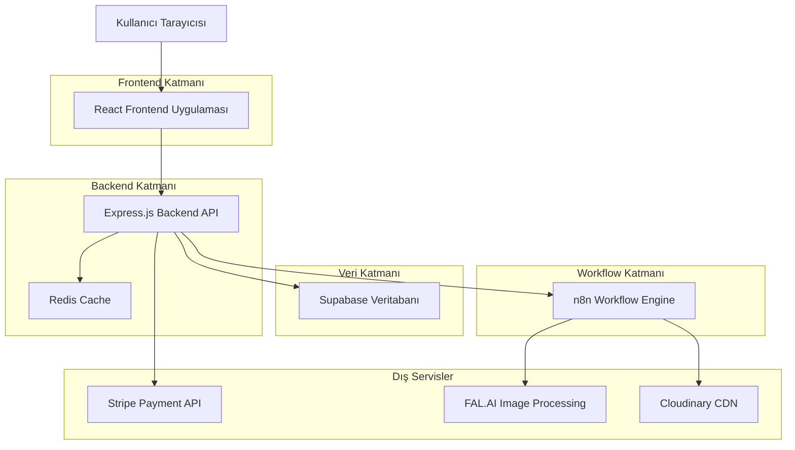
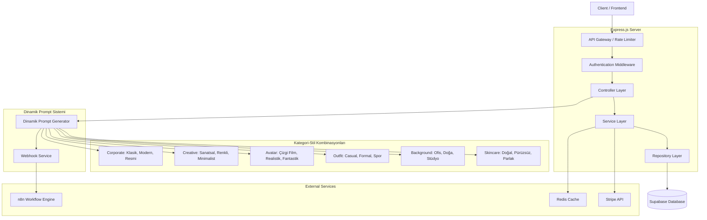
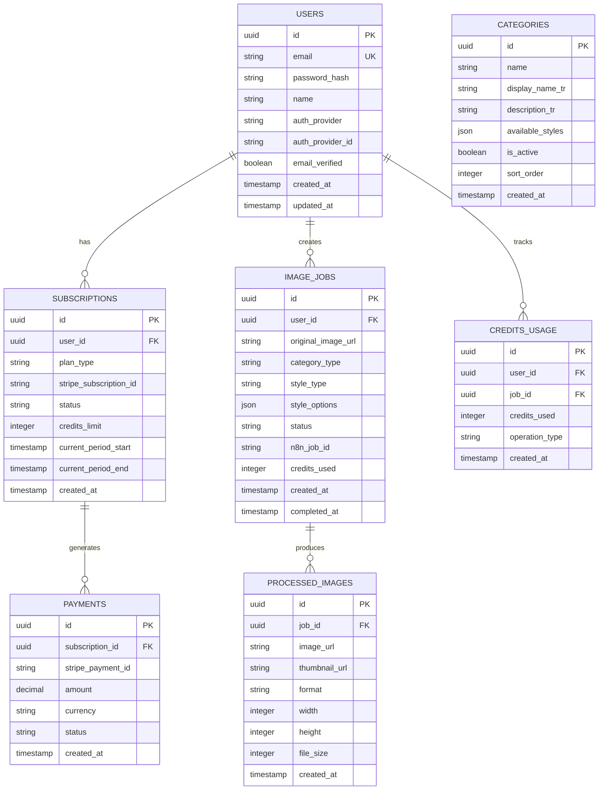

# ResimAI - Teknik Mimari Dokümantasyonu

## 1. Mimari Tasarım



## 2. Teknoloji Açıklaması

* **Frontend**: React\@18 + TypeScript + Tailwind CSS + Vite

* **Backend**: Express.js\@4 + TypeScript + JWT Authentication

* **Veritabanı**: Supabase (PostgreSQL)

* **Workflow Engine**: n8n (self-hosted)

* **Ödeme Sistemi**: Stripe

* **Görsel İşleme**: FAL.AI API

* **CDN/Storage**: Cloudinary

* **Cache**: Redis

* **Authentication**: Supabase Auth + OAuth (Google, Apple)

## 3. Route Tanımları

| Route          | Amaç                                             |
| -------------- | ------------------------------------------------ |
| /              | Ana sayfa, platform tanıtımı ve özellikler       |
| /auth/login    | Kullanıcı giriş sayfası                          |
| /auth/register | Kullanıcı kayıt sayfası                          |
| /auth/verify   | E-posta doğrulama sayfası                        |
| /dashboard     | Kullanıcı kontrol paneli, kredi durumu ve geçmiş |
| /categories    | Kategori seçim sayfası ve stil önizlemeleri      |
| /upload        | Görsel yükleme ve seçilen kategoriye özel stiller |
| /gallery       | İşlenmiş görseller ve sonuçlar                   |
| /subscription  | Abonelik planları ve ödeme yönetimi              |
| /profile       | Kullanıcı profil ayarları                        |
| /api-docs      | API dokümantasyonu (sadece Pro kullanıcılar)     |

## 4. API Tanımları

### 4.1 Temel API

**Kullanıcı kimlik doğrulama**

```
POST /api/auth/register
```

İstek:

| Parametre Adı | Parametre Tipi | Zorunlu | Açıklama                   |
| ------------- | -------------- | ------- | -------------------------- |
| email         | string         | true    | Kullanıcı e-posta adresi   |
| password      | string         | true    | Şifre (minimum 8 karakter) |
| name          | string         | true    | Kullanıcı adı              |

Yanıt:

| Parametre Adı | Parametre Tipi | Açıklama            |
| ------------- | -------------- | ------------------- |
| success       | boolean        | İşlem durumu        |
| user          | object         | Kullanıcı bilgileri |
| token         | string         | JWT access token    |

**Kategori listesi**

```
GET /api/categories
```

Yanıt:

| Parametre Adı | Parametre Tipi | Açıklama |
| ------------- | -------------- | -------- |
| categories    | array          | Mevcut kategoriler listesi |
| styles        | object         | Her kategori için mevcut stiller |

**Görsel yükleme ve işleme**

```
POST /api/images/upload
```

İstek:

| Parametre Adı | Parametre Tipi | Zorunlu | Açıklama                                                        |
| ------------- | -------------- | ------- | --------------------------------------------------------------- |
| file          | File           | true    | Yüklenecek görsel dosyası (max 10MB)                            |
| category      | string         | true    | Ana kategori (Corporate, Creative, Avatar, Outfit, Background, Skincare)  |
| style         | string         | true    | Seçilen kategoriye özel alt stil                               |
| options       | object         | false   | Kategori ve stil-specific seçenekler                           |

Yanıt:

| Parametre Adı   | Parametre Tipi | Açıklama                      |
| --------------- | -------------- | ----------------------------- |
| success         | boolean        | İşlem durumu                  |
| job\_id         | string         | n8n workflow job ID           |
| estimated\_time | number         | Tahmini işlem süresi (saniye) |

**Dinamik Prompt ile Görsel İşleme**

```
POST /api/images/process
```

İstek:

| Parametre Adı | Parametre Tipi | Zorunlu | Açıklama                                                        |
| ------------- | -------------- | ------- | --------------------------------------------------------------- |
| imageUrl      | string         | true    | İşlenecek görsel URL'si                                         |
| category      | string         | true    | Ana kategori (Corporate, Creative, Avatar, Outfit, Background, Skincare)  |
| style         | string         | true    | Seçilen kategoriye özel alt stil                               |

Yanıt:

| Parametre Adı   | Parametre Tipi | Açıklama                      |
| --------------- | -------------- | ----------------------------- |
| success         | boolean        | İşlem durumu                  |
| message         | string         | İşlem mesajı                  |
| data            | object         | Webhook yanıt verisi          |
| prompt          | string         | Oluşturulan dinamik prompt    |

**İşlem durumu sorgulama**

```
GET /api/images/status/:jobId
```

Yanıt:

| Parametre Adı  | Parametre Tipi | Açıklama                               |
| -------------- | -------------- | -------------------------------------- |
| status         | string         | PENDING, PROCESSING, COMPLETED, FAILED |
| progress       | number         | İşlem yüzdesi (0-100)                  |
| result\_urls   | array          | Tamamlandıysa sonuç URL'leri           |
| error\_message | string         | Hata durumunda mesaj                   |

**Kredi yönetimi**

```
GET /api/user/credits
```

Yanıt:

| Parametre Adı      | Parametre Tipi | Açıklama              |
| ------------------ | -------------- | --------------------- |
| remaining\_credits | number         | Kalan kredi sayısı    |
| total\_credits     | number         | Toplam kredi limiti   |
| reset\_date        | string         | Kredi yenileme tarihi |
| subscription\_plan | string         | Mevcut abonelik planı |

**Abonelik yönetimi**

```
POST /api/subscription/create
```

İstek:

| Parametre Adı   | Parametre Tipi | Zorunlu | Açıklama                             |
| --------------- | -------------- | ------- | ------------------------------------ |
| plan\_id        | string         | true    | Seçilen plan ID (free, premium, pro) |
| payment\_method | string         | true    | Stripe payment method ID             |
| billing\_cycle  | string         | true    | monthly veya yearly                  |

Yanıt:

| Parametre Adı    | Parametre Tipi | Açıklama                  |
| ---------------- | -------------- | ------------------------- |
| success          | boolean        | İşlem durumu              |
| subscription\_id | string         | Stripe subscription ID    |
| client\_secret   | string         | Payment confirmation için |

## 5. Sunucu Mimarisi



## 6. Dinamik Prompt Sistemi

### 6.1 Prompt Oluşturma Fonksiyonu

```typescript
const generatePrompt = (category: string, style: string): string => {
  const prompts: { [key: string]: { [key: string]: string } } = {
    'Corporate': {
      'Klasik': 'Put the person in a traditional office environment with classic wooden furniture and formal atmosphere. Also, make sure they wear a classic business suit with traditional styling and conservative colors.',
      'Modern': 'Put the person in a modern tech office environment with glass walls, contemporary furniture, and innovative workspace design. Also, make sure they wear a sleek contemporary business suit with modern cut and trendy styling.',
      'Resmi': 'Put the person in a very formal corporate boardroom environment with mahogany furniture and executive atmosphere. Also, make sure they wear a strictly formal business suit with conservative styling, tie, and traditional corporate appearance.'
    },
    'Creative': {
      'Sanatsal': 'Transform the person with artistic effects: add colorful paint splashes on their face and hair, apply vibrant artistic makeup with bold colors, add creative face painting designs, and enhance with artistic lighting effects on the person. Keep the original background unchanged, focus only on making the person artistic and colorful.',
      'Renkli': 'Create a vibrant and colorful portrait with rainbow color palette, dynamic lighting effects, and energetic atmosphere with bright saturated colors throughout the composition.',
      'Minimalist': 'Create a minimalist portrait with clean lines, neutral color palette, simple geometric shapes, and elegant composition with plenty of white space and subtle shadows.'
    },
    // ... diğer kategoriler
  };
  
  return prompts[category]?.[style] || 'Enhance and improve the person in the image with professional quality.';
};
```

### 6.2 Webhook Entegrasyonu

**Webhook URL**: `https://1qe4j72v.rpcld.net/webhook-test/cd11e789-5e4e-4dda-a86e-e1204e036c82`

**İstek Formatı**: GET request with query parameters
- `imageUrl`: İşlenecek görsel URL'si
- `category`: Seçilen kategori
- `style`: Seçilen stil
- `prompt`: Dinamik olarak oluşturulan prompt
- `userId`: Kullanıcı ID'si

**Örnek İstek**:
```
GET https://1qe4j72v.rpcld.net/webhook-test/cd11e789-5e4e-4dda-a86e-e1204e036c82?imageUrl=https://example.com/image.jpg&category=Corporate&style=Modern&prompt=Put%20the%20person%20in%20a%20modern%20tech%20office...&userId=123
```

## 7. Veri Modeli

### 6.1 Veri Modeli Tanımı



### 6.2 Veri Tanımlama Dili (DDL)

**Kullanıcılar Tablosu (users)**

```sql
-- Tablo oluşturma
CREATE TABLE users (
    id UUID PRIMARY KEY DEFAULT gen_random_uuid(),
    email VARCHAR(255) UNIQUE NOT NULL,
    password_hash VARCHAR(255),
    name VARCHAR(100) NOT NULL,
    auth_provider VARCHAR(50) DEFAULT 'email',
    auth_provider_id VARCHAR(255),
    email_verified BOOLEAN DEFAULT false,
    created_at TIMESTAMP WITH TIME ZONE DEFAULT NOW(),
    updated_at TIMESTAMP WITH TIME ZONE DEFAULT NOW()
);

-- İndeks oluşturma
CREATE INDEX idx_users_email ON users(email);
CREATE INDEX idx_users_auth_provider ON users(auth_provider, auth_provider_id);

-- RLS politikaları
ALTER TABLE users ENABLE ROW LEVEL SECURITY;
CREATE POLICY "Users can view own data" ON users FOR SELECT USING (auth.uid() = id);
CREATE POLICY "Users can update own data" ON users FOR UPDATE USING (auth.uid() = id);
```

**Abonelikler Tablosu (subscriptions)**

```sql
CREATE TABLE subscriptions (
    id UUID PRIMARY KEY DEFAULT gen_random_uuid(),
    user_id UUID REFERENCES users(id) ON DELETE CASCADE,
    plan_type VARCHAR(20) NOT NULL CHECK (plan_type IN ('free', 'premium', 'pro')),
    stripe_subscription_id VARCHAR(255),
    status VARCHAR(20) DEFAULT 'active' CHECK (status IN ('active', 'canceled', 'past_due')),
    credits_limit INTEGER NOT NULL DEFAULT 5,
    current_period_start TIMESTAMP WITH TIME ZONE,
    current_period_end TIMESTAMP WITH TIME ZONE,
    created_at TIMESTAMP WITH TIME ZONE DEFAULT NOW()
);

CREATE INDEX idx_subscriptions_user_id ON subscriptions(user_id);
CREATE INDEX idx_subscriptions_stripe_id ON subscriptions(stripe_subscription_id);
```

**Görsel İşleri Tablosu (image\_jobs)**

```sql
CREATE TABLE categories (
    id UUID PRIMARY KEY DEFAULT gen_random_uuid(),
    name VARCHAR(50) UNIQUE NOT NULL,
    display_name_tr VARCHAR(100) NOT NULL,
    description_tr TEXT,
    available_styles JSONB NOT NULL DEFAULT '[]',
    is_active BOOLEAN DEFAULT true,
    sort_order INTEGER DEFAULT 0,
    created_at TIMESTAMP WITH TIME ZONE DEFAULT NOW()
);

CREATE TABLE image_jobs (
    id UUID PRIMARY KEY DEFAULT gen_random_uuid(),
    user_id UUID REFERENCES users(id) ON DELETE CASCADE,
    original_image_url TEXT NOT NULL,
    category_type VARCHAR(20) NOT NULL CHECK (category_type IN ('kurumsal', 'linkedin', 'yaratici', 'avatar', 'arkaplan')),
    style_type VARCHAR(50) NOT NULL,
    style_options JSONB DEFAULT '{}',
    status VARCHAR(20) DEFAULT 'pending' CHECK (status IN ('pending', 'processing', 'completed', 'failed')),
    n8n_job_id VARCHAR(255),
    credits_used INTEGER DEFAULT 1,
    created_at TIMESTAMP WITH TIME ZONE DEFAULT NOW(),
    completed_at TIMESTAMP WITH TIME ZONE
);

CREATE INDEX idx_categories_name ON categories(name);
CREATE INDEX idx_categories_active ON categories(is_active, sort_order);

CREATE INDEX idx_image_jobs_user_id ON image_jobs(user_id);
CREATE INDEX idx_image_jobs_category ON image_jobs(category_type);
CREATE INDEX idx_image_jobs_status ON image_jobs(status);
CREATE INDEX idx_image_jobs_created_at ON image_jobs(created_at DESC);
```

**İşlenmiş Görseller Tablosu (processed\_images)**

```sql
CREATE TABLE processed_images (
    id UUID PRIMARY KEY DEFAULT gen_random_uuid(),
    job_id UUID REFERENCES image_jobs(id) ON DELETE CASCADE,
    image_url TEXT NOT NULL,
    thumbnail_url TEXT,
    format VARCHAR(10) NOT NULL,
    width INTEGER,
    height INTEGER,
    file_size INTEGER,
    created_at TIMESTAMP WITH TIME ZONE DEFAULT NOW()
);

CREATE INDEX idx_processed_images_job_id ON processed_images(job_id);
```

**Başlangıç Verileri**

```sql
-- Kategori verileri
INSERT INTO categories (name, display_name_tr, description_tr, available_styles, sort_order) VALUES
('kurumsal', 'Kurumsal', 'Profesyonel iş fotoğrafları ve şirket profilleri için', 
 '["takim_elbise", "blazer", "gomlek", "resmi_etkinlik", "toplanti"]', 1),

('linkedin', 'LinkedIn', 'Sosyal medya profil fotoğrafları ve networking için', 
 '["profesyonel", "dostane", "guvenilir", "modern", "klasik"]', 2),

('yaratici', 'Yaratıcı', 'Artistik ve stilize edilmiş fotoğraflar için', 
 '["sinematik", "pop_art", "vintage", "sanatsal", "dramatik"]', 3),

('avatar', 'Avatar', 'Profil simgeleri ve dijital kimlik görselleri için', 
 '["minimalist", "cizgi_roman", "3d", "pixel_art", "vektorel"]', 4),

('arkaplan', 'Arka Plan Değiştirme', 'Background replacement ve stüdyo efektleri için', 
 '["studyo_beyaz", "doga", "sehir", "gradient", "transparan"]', 5);

-- Varsayılan abonelik planları
INSERT INTO subscriptions (user_id, plan_type, credits_limit, status) 
SELECT id, 'free', 5, 'active' FROM users WHERE email = 'demo@example.com';

-- Örnek işlem kayıtları
INSERT INTO image_jobs (user_id, original_image_url, category_type, style_type, style_options, status)
VALUES 
('user-uuid', 'https://example.com/sample.jpg', 'linkedin', 'profesyonel', '{"background": "grey", "crop": "tight"}', 'completed'),
('user-uuid', 'https://example.com/sample2.jpg', 'yaratici', 'sinematik', '{"style": "cinematic", "variants": 3}', 'processing'),
('user-uuid', 'https://example.com/sample3.jpg', 'kurumsal', 'takim_elbise', '{"background": "office", "lighting": "professional"}', 'completed');
```

